# Weight-Aware Activation Sparsity with Constrained Bayesian Optimization Scheduling for Large Language Models

Ming Wang, Miao Zhang\*, Xuebo Liu, Liqiang Nie Harbin Institute of Technology (Shenzhen) 190110509@stu.hit.edu.cn, {zhangmiao, liuxuebo, nieliqiang}@hit.edu.cn

## Abstract

Activation sparsity provides a dynamic, inputdependent alternative to weight pruning for accelerating inference in large language models (LLMs), effectively reducing unnecessary computations and memory accesses during the forward pass. Despite its promise, existing activation sparsification methods suffer from two major limitations: (1) solely relying on activation magnitude for sparsification, ignoring the coupling influence with the corresponding weights, (2) applying uniform sparsity rates across all blocks without considering block-wise sparsity sensitivity. To address these issues, this paper proposes a novel training-free weightaware activation sparsity framework, called WAS. Firstly, with analyzing the coupling relationship between weight and activation, we introduce a weight-aware scoring method to measure the activation importance in sparsification. Then, a novel constrained Bayesian optimization algorithm is further devised to set a suitable sparsity ratio for all blocks based on the sparsity sensitivity. Finally, we imple ment a custom GPU sparsity kernel to support the resulting sparsity patterns for wall clock decoding speed-ups. Our WAS achieves competitive performance at 60% model-level sparsity and significantly outperforms prior methods at higher sparsity levels, achieving up to 1.68× inference speed-up—at no retraining or weight update. Codes are available at https://github.com/HITSZ-Miao-Group/WAS.

## 1 Introduction

Large language models (LLMs) have demonstrated remarkable performance across a wide range of natural language processing tasks (Brown et al., 2020). However, the enormous computational and memory demands associated with deploying these models, which often contain billions of parameters, pose significant challenges for real-world applications. Model compression has emerged as a promising approach to tackle this issue, with quantization (Frantar et al., 2022; Shao et al., 2023; Zhao et al., 2024) and pruning (Kim et al., 2024; Ashkboos et al., 2024; Men et al., 2024) being two widely adopted techniques. Quantization accelerates inference by representing weights and activations using lower bits, while pruning removes redundant parts of the model to reduce computational cost. As illustrated in Figure 1a, activation sparsity (Raihan and Aamodt, 2020; Grimaldi et al., 2023; Chen et al., 2023) offers a more dynamic and input-dependent alternative compared to weight pruning. Instead of statically pruning the model prior to inference, activation sparsity identifies and skips unimportant weights at inference time based on the sparsity of the intermediate activations. This allows the model to selectively omit computations based on the input, making activation sparsity a more flexible and adaptive approach for inference acceleration.

Previous work on activation sparsity has primarily focused on older ReLU-based large language models such as OPT (Zhang et al., 2022), where the inherent sparsity of the ReLU function naturally leads to highly sparse activations. This property can be effectively leveraged to accelerate inference. However, modern LLMs have largely transitioned to GLU-based activation functions (Shazeer, 2020), such as SwiGLU (Chowdhery et al., 2023), which no longer exhibit this natural sparsity. To reintroduce sparsity into these models, some approaches (Mirzadeh et al., 2023; Song et al., 2024) have replaced the activation functions with ReLU and performed continued pre-training, incurring significant computational costs. More recently, several studies (Liu et al., 2024; Lee et al., 2024) have observed that even without additional pre-training, modern models can still exhibit activation patterns that resemble sparsity, suggesting the potential for training-free sparsification techniques. However, these methods face two major limitations. Firstly, they determine the sparsification threshold solely based on the magnitude of the activations, without accounting for the role of the corresponding weights in the sparsification process. Secondly, they apply a uniform sparsity rate across all blocks, neglecting the fact that blocks at different depths in the model contribute differently to its overall performance.

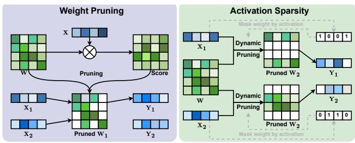  
(a) Differences between weight pruning and activation sparsity

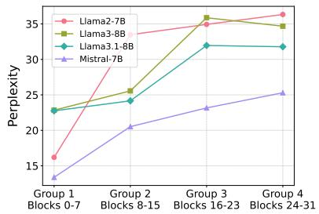  
(b) Sensitivity to sparsity across transformer blocks  
Figure 1: (a) Comparison of weight pruning and activation sparsity, where the latter one is dynamic and inputdependent. (b) Sensitivity analysis of transformer blocks under different sparsity configurations. We divide the transformer into four contiguous block groups (8 blocks each) and evaluate perplexity when sparsifying one group to 60% while others remain at 80%.

To address the two aforementioned aspects, we propose a novel activation sparsity framework, termed as WAS. Firstly, we analyze the coupling effect of weights and activations on the sparsification error and reveal that both activation values and weights play equally important roles. Based on this insight, we propose a new thresholding strategy that jointly considers the magnitudes of both activations and weights to determine whether a value should be sparsified. In addition, as shown in Figure 1b, we observe that blocks at different depths exhibit varying sensitivities to sparsity and we introduce a constrained Bayesian optimization approach to assign block-wise sparsity rates, instead of applying a uniform sparsity rate across all blocks. Finally, we design an optimized GPU kernel that directly integrates weight-aware sparsity logic into the computation pipeline, enabling efficient, structure-sensitive inference acceleration with minimal overhead.

Our key contributions can be summarized as:

• A novel activation sparsity framework called WAS is proposed, which incorporates weight information into the thresholding decision by analyzing the mathematical formulation of the error introduced during sparsification.

• We introduce a constrained Bayesian optimization algorithm that dynamically allocates sparsity rates across different blocks, motivated by empirical observation (Figure 1b). Without additional training, our method achieves up to 1.52 inference acceleration with acceptable performance degradation in 60% sparsity level, and significantly outperforms the baselines in 75% sparsity.

• Furthermore, we develop a custom GPU kernel that integrates weight information into the computation pipeline, supports non-uniform sparsity and enables structure-specific thresholding across blocks. Our kernel is compatible with general Transformer architecture and supports practical inference deployment.

## 2 Related Work

Activation sparsity can be broadly categorized into training-based and training-free approaches. We briefly review both lines of research below.

## 2.1 Training-based Activation Sparsity

Several training-based methods have been proposed to induce activation sparsity in neural networks. (Kurtz et al., 2020) first identified the natural sparsity phenomenon caused by ReLU activations in CNNs, and further enhanced this sparsity through regularization-based training, ultimately enabling faster convolution by exploiting the sparse structure of activations. DejaVu (Liu et al., 2023) observed that, due to residual connections in deep neural networks, token embeddings across adjacent layers change slowly, and neurons with larger activation norms dominate the forward computation. To take advantage of this, DejaVu trains a lightweight two-layer MLP to predict neurons with smaller activation norms and selectively prunes them, achieving significant inference acceleration. While earlier work largely focused on ReLU-based models, ReLUfication (Mirzadeh et al., 2023) and ProSparse (Song et al., 2024) aim to recover similar sparsity in modern LLMs by replacing the original activation functions with ReLU and performing continued pre-training to restore ReLU-like behavior. (Zhang et al., 2024) further explores the design space of activation functions by retraining small models with ReLU2 activation, which has been shown to induce even higher activation sparsity than standard ReLU.

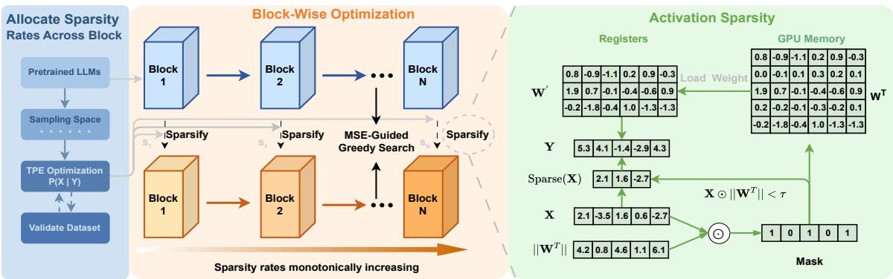  
Figure 2: An overview of our WAS. WAS assigns inter-block sparsity using constrained Bayesian optimization, and intra-block sparsity by greedy search, while incorporating weight information into the sparsification process.

While effective, these approaches typically require additional training or modification to the model architecture, which limits their applicability in deployment scenarios where retraining is not feasible or desirable.

## 2.2 Training-free Activation Sparsity

To circumvent the limitations of training-based methods, several studies have proposed trainingfree activation sparsity techniques. By applying a top-k sparsification to the MLP layers in T5 (Raffel et al., 2020a) and ViT (Dosovitskiy et al., 2020), (Li et al., 2022) achieves notable performance improvements. Griffin (Dong et al., 2024) identifies a flocking effect, where different tokens within the same sentence tend to activate similar neurons, while different sentences activate distinct sets of neurons. Based on this observation, they use the activations from prompt tokens to predict which neurons will be activated in the remainder of the sentence, thereby enabling inference acceleration. Similarly, (Ma et al., 2024) leverages the activations from the prefill phase to generate sparsity masks used during the generation phase, improving efficiency without modifying the model. CATS (Lee et al., 2024) proposes a relative magnitudebased sparsification technique by analyzing the distribution of gate activations in MLP layers on a calibration set to determine cutoff thresholds. This enables selective computation of $W _ { \mathsf { u p } }$ and $W _ { \mathrm { d o w n } }$ , reducing the cost of MLP inference. However, CATS only sparsify gate outputs, limiting its impact to a subset of the MLP computation. In contrast, TEAL (Liu et al., 2024) applies sparsification to the inputs of all components in the model, achieving model-level activation sparsity and significantly improving overall computational efficiency.

Nevertheless, most of these methods are still in their infancy, relying on straightforward heuristics without deeper modeling or optimization.

## 3 Method

In this section, we provide a detailed overview of WAS, as illustrated in Figure 2. We first introduce the preliminaries and motivation in Section 3.1. Next, we introduce our sparsification method in Section 3.2, describe the sparsity allocation strategies across and within transformer blocks in Sections 3.3 and 3.4, and detail our custom GPU kernel for efficient inference acceleration in Section 3.5.

## 3.1 Preliminaries and Motivation

The core idea of activation sparsity lies in identifying and zeroing out the activations that have minimal impact on model performance, and inference acceleration can be achieved by skipping the loading of weight columns that would be multiplied with sparsified activations. This is typically achieved through threshold-based methods, which can be formally expressed as:

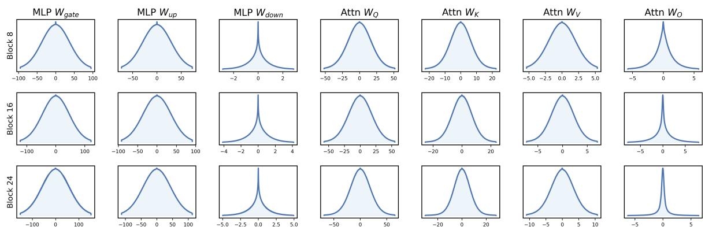  
Figure 3: Distributions of activations (after being scaled by the corresponding weight norm) in Blocks 8, 16, and 24 of LLaMA-3-8B exhibit symmetric and unimodal around zero. This property enables reliable threshold selection for a given sparsity level.

$$
s p ( x _ { i } ) = { \left\{ \begin{array} { l l } { 0 } & { { \mathrm { i f ~ } } | x _ { i } | < \tau } \\ { x _ { i } } & { { \mathrm { o t h e r w i s e } } } \end{array} \right. } ,\tag{1}
$$

where $\mathbf { x } ~ = ~ [ x _ { 1 } , x _ { 2 } , \ldots , x _ { m } ]$ is the input. $s p ( \cdot )$ is the sparse operation, and τ denotes the cutoff threshold. The error of the sparsification process can be expressed as:

$$
\mathcal { L } = | | \mathbf { x } \mathbf { W } ^ { T } - \mathbf { x } ^ { ' } \mathbf { W } ^ { T } | | ,\tag{2}
$$

$$
\mathbf { x } ^ { \prime } = s p ( \mathbf { x } ) ,\tag{3}
$$

where $\mathbf { W } \in \mathbb { R } ^ { n \times m }$ is the model weight. According to Equation 2, we observe that weights also play a significant role in the process of model sparsity. An intuitive idea is to incorporate weights into the decision-making process of whether an activation value should be set to zero.

Secondly, Transformer-based LLMs exhibit varying degrees of sensitivity to sparsity across different blocks. Formally, for a LLM with L blocks, the model sparsity is defined as a weighted average across all blocks in the model:

$$
S = \frac { 1 } { L } \sum _ { l = 1 } ^ { L } p _ { l }\tag{4}
$$

where $p _ { l }$ is the sparsity ratio of the l-th block. Typically, information flows hierarchically from shallow to deep blocks, where shallow blocks primarily capture fundamental token-level semantics, serving as the foundation for subsequent high-level feature extraction and propagation. Intuitively, these shallower blocks, being critical to the overall architecture, are more sensitive to sparsity and thus require lower sparsity levels. Previous weight pruning approaches have addressed similar considerations: LLM\_Pruner (Ma et al., 2023) selectively prunes intermediate transformer blocks, while OWL (Yin et al., 2023) dynamically adjusts sparsity ratios based on feature outliers. Motivated by these insights, we explore the necessity of assigning block-wise activation sparsity ratios, instead of applying a uniform sparsity rate across all blocks as in prior work (Liu et al., 2024).

## 3.2 Weight-aware Activation Sparsification

Inspired by WANDA (Sun et al., 2023), we integrate weight information into our sparsification framework, with a key distinction being our focus on activation pruning rather than weight pruning. Specifically, by employing the L1 norm, Equation 2 can be extended as follows:

$$
\begin{array} { r l } {  { \mathcal { L } = \sum _ { j = 1 } ^ { n } \displaystyle \lvert \sum _ { i = 1 } ^ { m } ( x _ { i } - x _ { i } ^ { ' } ) w _ { i , j } \rvert } } \\ & { \leq \displaystyle \sum _ { i = 1 } ^ { m } \lvert x _ { i } - x _ { i } ^ { ' } \rvert \times \sum _ { j = 1 } ^ { n } \lvert w _ { i , j } \rvert } \\ & { = \displaystyle \sum _ { i = 1 } ^ { m } \lvert x _ { i } - x _ { i } ^ { ' } \rvert \times \| \mathbf { W } _ { i , : } ^ { T } \| _ { 1 } , } \end{array}\tag{5}
$$

where $w _ { i , j }$ denote the element at the i-th row and $j \cdot$ -th column of $\mathbf { W } ^ { T }$ . Assume we select one of the two activation values $x _ { p }$ and $x _ { q } ,$ which are close to each other numerically, for sparsification. According to Equation 5, the corresponding sparsification errors are $| x _ { p } | \times \| \mathbf { W } _ { p , : } ^ { T } \| _ { 1 }$ and $| x _ { q } | \times \| \mathbf { W } _ { q , : } ^ { T } \| _ { 1 }$ To minimize the sparsification loss, the decision should be determined by the relative magnitudes of $\| \mathbf { W } _ { p , : } ^ { T } \| _ { 1 }$ and $\| \mathbf { W } _ { q , : } ^ { T } \| _ { 1 }$ . Consequently, the sparsification process depends not only on activation but also incorporates weight norm, as mathematically formulated below:

$$
\mathrm { m a s k } ( x _ { i } , \mathbf { W } ) = \left\{ \begin{array} { l l } { 0 , } & { \mathrm { i f } | x _ { i } | \times \| \mathbf { W } _ { i , : } ^ { T } \| _ { 1 } < \tau } \\ { 1 , } & { \mathrm { o t h e r w i s e } } \end{array} \right.\tag{6}
$$

$$
\mathbf { x } ^ { ' } = \mathbf { x } \odot \mathrm { m a s k } ( \mathbf { x } , \mathbf { W } ) .\tag{7}
$$

Notably, the column-wise L1 norm of weights can be precomputed prior to sparsification as an mdimensional vector, introducing negligible computational overhead.

In determining the sparsity threshold $\tau ,$ existing approaches generally fall into two categories: (1) online computation via top-k selection of activation values, which introduces additional runtime overhead, and (2) offline estimation through cumulative distribution function (CDF) modeling of activations using calibration data, which requires precise distribution modeling to guarantee target sparsity rates. Building upon the foundational observation by (Liu et al., 2024) that LLM activations typically follow zero-mean Gaussian or Laplacian distributions, our analysis in Figure 3 demonstrates that this statistical property remains remarkably consistent when activations are modulated by weight information across different layers and model architectures. This statistical regularity enables threshold selection based on the distribution of activations scaled by weight norms. Formally, given a target sparsity ratio $p \in [ 0 , 1 ]$ , the threshold $\tau _ { p }$ is determined by:

$$
\frac { 1 } { m } \sum _ { i = 1 } ^ { m } \mathbb { P } \left( | x _ { i } | \times \Vert \mathbf { W } _ { i , : } ^ { T } \Vert _ { 1 } \leq \tau _ { p } \right) = p\tag{8}
$$

## 3.3 Inter-Block Sparsity Allocation

Determining appropriate sparsity ratios across blocks is critical for optimizing overall model performance. As discussed in Section 3.1, transformer blocks exhibit varying sensitivity to sparsity, particularly under high global sparsity. Figure 1b illustrates this positional sensitivity: reducing sparsity in shallow blocks yields substantial performance gains, while reducing sparsity in deeper blocks has limited effect. This trend reveals a monotonic decrease in sparsity sensitivity from shallow to deep layers. Motivated by this observation, we propose a constrained Bayesian optimization framework for inter-block sparsity allocation.

Specifically, we utilize a variant of Bayesian optimization, the Tree-structured Parzen Estimator (TPE) (Bergstra et al., 2011), to search for the optimal sparsity ratios. Traditional Bayesian optimization typically relies on Gaussian processes to model the objective function which struggles to scale in high-dimensional spaces. TPE employs kernel density estimation for modeling, which not only reduces computational complexity but also exhibits better performance in high-dimensional optimization tasks.

```latex
Algorithm 1 Constrained Bayesian Optimization
Input:
Model with L blocks, validation dataset ${ \mathcal { D } } _ { \mathrm { v a l } } ,$ , target
sparsity level r, iteration counts $N _ { \mathrm { t r i a l s } } ,$ , greedy lookup
table $\dot { T }$ with L blocks
Output:
Optimal sparsity ratios $\boldsymbol { s } \in \mathbb { R } ^ { L }$ for all blocks
1: Initialize Optuna study with TPESampler
2: for $t \gets 1$ to $N _ { \mathrm { t r i a l s } }$ do
3: s<sub>1</sub> TPESample $\cdot ( r - 0 . 0 5 , r )$ ▷ Initialize sparsity
for the first block
4: for $i \gets 2$ to L do
5: s<sub>i</sub> TPESampler $( s _ { i - 1 } , r + 0 . 0 5 )$
6: end for
7: $\begin{array} { r } { \mathbf { i f } \mid \frac { 1 } { L } \sum _ { i = 1 } ^ { L } s _ { i } - r \vert > \epsilon } \end{array}$ then
8: continue ▷ Resample
9: end if
10: ApplySparsity $( \mathcal { M } , \{ s _ { i } \} _ { i = 1 } ^ { L } , T )$
11: <sup>ppl</sup> ← <sup>Evaluate</sup> $( M , \mathcal { D } _ { \mathrm { v a l } } )$
12: UpdateResult $( \{ s _ { i } \} _ { i = 1 } ^ { L } , \mathsf { p p l } )$
13: end for
14: return s
```

As detailed in Algorithm 1, for each trial, we uniformly sample the sparsity ratio within a narrow range for the first block, while imposing a constraint on the subsequent blocks, using the sampled value from the previous block as the lower bound for the current block. This constraint not only aligns with our empirical observations but also effectively reduces the search space. We will discuss the impact of applying constraints on the final results in detail in Section 4.5. For each trial, we use the model’s perplexity on the WikiText2 (Merity et al., 2016) as the evaluation metric.

## 3.4 Intra-Block Sparsity Allocation

Given the overall sparsity ratio of a block, we further optimize the sparsity ratios for its internal components (e.g., Q/K/V matrices) to achieve the best performance. Due to the non-differentiable nature of threshold-based methods, we initially employed straight-through gradient estimator (STE) (Bengio et al., 2013) to optimize component-wise sparsity allocation within each block. However, we identified critical gradient backpropagation failures to the sparsity parameters. While alternative approaches like Bayesian optimization were explored, they exhibited prohibitively slow convergence and susceptibility to local optima. We ultimately follow (Liu et al., 2024) to determine the optimal sparsity configuration for intra-block components by greedy search. The detailed procedure is provided in Algorithm 2 at Appendix D.

<table><tr><td rowspan="2">Dataset</td><td rowspan="2">Sparsity</td><td rowspan="2">Methods / Models</td><td colspan="3">LLaMA-2</td><td colspan="2">LLaMA-3</td><td colspan="2">LLaMA-3.1</td><td>Mistral</td></tr><tr><td>7B</td><td>13B</td><td>70B</td><td>8B</td><td>70B</td><td>8B</td><td>70B</td><td>7B</td></tr><tr><td rowspan="10">WikiText2</td><td>0%</td><td>Baseline</td><td>5.47</td><td>4.88</td><td>3.32</td><td>6.14</td><td>2.85</td><td>6.27</td><td>2.83</td><td>3.12</td></tr><tr><td rowspan="3">40%</td><td>CATS</td><td>46.87</td><td>48.63</td><td>54.22</td><td>502.19</td><td>71.84</td><td>162.33</td><td>66.95</td><td>4.6e4</td></tr><tr><td>WANDA</td><td>6.07</td><td>5.38</td><td>3.74</td><td>7.49</td><td>4.38</td><td>7.59</td><td>4.44</td><td>5.68</td></tr><tr><td>TEAL</td><td>5.74</td><td>5.02</td><td>3.47</td><td>6.60</td><td>3.48</td><td>6.61</td><td>3.41</td><td>5.40</td></tr><tr><td></td><td>WAS</td><td>5.68</td><td>4.99</td><td>3.47</td><td>6.52</td><td>3.39</td><td>6.61</td><td>3.38</td><td>5.40</td></tr><tr><td rowspan="3">60%</td><td>WANDA</td><td>10.84</td><td>8.49</td><td>5.27</td><td>26.40</td><td>9.54</td><td>25.54</td><td>8.18</td><td>11.44</td></tr><tr><td>TEAL</td><td>6.80</td><td>5.66</td><td>4.09</td><td>10.04</td><td>5.70</td><td>8.21</td><td>5.74</td><td>6.10</td></tr><tr><td>WAS</td><td>6.56</td><td>5.54</td><td>4.09</td><td>8.30</td><td>5.60</td><td>8.14</td><td>5.59</td><td>6.09</td></tr><tr><td rowspan="2">75%</td><td>TEAL</td><td>42.15</td><td>12.17</td><td>6.37</td><td>87.48</td><td>10.42</td><td>27.73</td><td>9.49</td><td>13.02</td></tr><tr><td>WAS</td><td>12.76</td><td>8.16</td><td>6.19</td><td>28.33</td><td>9.91</td><td>26.61</td><td>9.27</td><td>10.34</td></tr><tr><td rowspan="9">C4</td><td>0%</td><td>Baseline</td><td>7.26</td><td>6.73</td><td>5.71</td><td>9.44</td><td>7.16</td><td>9.53</td><td>7.10</td><td>3.12</td></tr><tr><td rowspan="5">40%</td><td>CATS</td><td>43.96</td><td>51.10</td><td>55.73</td><td>325.24</td><td>102.20</td><td>136.29</td><td>95.64</td><td>4.4e4</td></tr><tr><td>WANDA</td><td>8.12</td><td>7.40</td><td>6.03</td><td>11.91</td><td>8.32</td><td>12.00</td><td>8.27</td><td>8.91</td></tr><tr><td>TEAL</td><td>7.55</td><td>6.90</td><td>5.82</td><td>10.45</td><td>7.56</td><td>10.29</td><td>7.47</td><td>8.57</td></tr><tr><td>WAS</td><td>7.52</td><td>6.88</td><td>5.82</td><td>10.18</td><td>7.52</td><td>10.26</td><td>7.44</td><td>8.57</td></tr><tr><td>WANDA</td><td>14.09</td><td>11.79</td><td>7.81</td><td>39.71</td><td>16.03</td><td>39.20</td><td>12.98</td><td>16.25</td></tr><tr><td rowspan="3">60%</td><td>TEAL</td><td>9.03</td><td>7.80</td><td>6.34</td><td>15.93</td><td>9.47</td><td>13.17</td><td>9.43</td><td>9.50</td></tr><tr><td>WAS</td><td>8.78</td><td>7.68</td><td>6.34</td><td>13.45</td><td>9.35</td><td>13.07</td><td>9.25</td><td>9.47</td></tr><tr><td>TEAL</td><td>51.34</td><td>16.38</td><td>8.54</td><td>86.68</td><td>15.73</td><td>47.99</td><td>14.49</td><td>17.65</td></tr><tr><td rowspan="2">75%</td><td>WAS</td><td>15.56</td><td>11.10</td><td>8.38</td><td>43.54</td><td>14.93</td><td>41.29</td><td>13.99</td><td>14.03</td></tr><tr><td></td><td></td><td></td><td></td><td></td><td></td><td></td><td></td><td></td></tr></table>

Table 1: Comparative analysis of perplexity performance(lower is better) across LLaMA and Mistral model families at 40%, 60% and 75% sparsity levels. We omit WANDA 75% as it degenerates seriously.

## 3.5 Hardware Acceleration

We implement a custom Triton kernel (Tillet et al., 2019) specifically tailored to the sparsity patterns produced by WAS, aiming to achieve practical inference acceleration. Building upon DejaVu (Liu et al., 2023), our kernel integrates the mask generation process for activation sparsification directly into the computation pipeline. It performs FP16 accumulation along the external SplitK dimension to reduce memory overhead, and employs a cacheaware scheduling strategy that prioritizes activations reused across thread blocks while deprioritizing block-specific weights. On top of this foundation, we introduce several key enhancements: (1) We incorporate weight norms, as described in Section 3.2, directly into the mask generation process; (2) We extend the kernel to support non-uniform sparsity, allowing different sparsity rates across transformer blocks; (3) We generalize the thresholding mechanism to support distinct thresholds for different substructures (e.g., Q, K, V), enabling more fine-grained mask generation under varying sparsity levels.

## 4 Experiments

## 4.1 Experimental Settings

Models and Datasets. We conduct comprehensive evaluations of WAS on several leading opensource LLMs, including the META’s LLaMA-2 (Touvron et al., 2023), LLaMA-3, LLaMA-3.1 (Grattafiori et al., 2024) and Mistral (Jiang et al., 2023) families. We assess the generative capabilities of the sparsified models on the WikiText2 (Merity et al., 2016) and C4 (Raffel et al., 2020b) datasets. For reasoning performance, we evaluate all models on five zero-shot tasks, including ARC-Easy, ARC-Challenge (Clark et al., 2018), HellaSwag (Zellers et al., 2019), PIQA(Bisk et al., 2020), and Winogrande (Sakaguchi et al., 2021). Furthermore, we conduct evaluations on the 5- shot MMLU (Hendrycks et al., 2020) and GSM8K (Cobbe et al., 2021) tasks. All evaluations are performed using the lm-evaluation-harness (Gao et al., 2024) framework.

Baseline and Implement Details. Given the relatively limited research on training-free model sparsification, we primarily compare our method with TEAL, the current state-of-the-art in this category. We additionally include CATS as a baseline, which achieves up to 40% sparsity. To broaden the comparison, we also evaluate against WANDA. We randomly select ten 2,048-token sequences from the Alpaca (Taori et al., 2023) training set to profile activation value distributions for threshold determination as detailed in Equation 8. The intra-block sparsity ratios were optimized through a greedy algorithm minimizing MSE loss between original and sparsified models, while the inter-block sparsity allocation was systematically determined via 50 trials of TPE-based Bayesian optimization using WikiText2 perplexity as the optimization objective.

<table><tr><td>Models</td><td>Sparsity</td><td>Methods</td><td>ARC-C</td><td>ARC-E</td><td>HellaSwag</td><td>PIQA</td><td>Winogrande</td><td>GSM8K</td><td>MMLU</td><td>AVG</td></tr><tr><td rowspan="5">LLaMA-2-7B</td><td>0%</td><td>Baseline</td><td>43.43</td><td>76.35</td><td>57.14</td><td>78.07</td><td>69.14</td><td>13.57</td><td>45.87</td><td>54.80</td></tr><tr><td rowspan="3">60%</td><td>WANDA</td><td>30.80</td><td>64.94</td><td>43.51</td><td>71.49</td><td>65.75</td><td>2.43</td><td>28.07</td><td>43.86</td></tr><tr><td>TEAL</td><td>38.73</td><td>72.60</td><td>52.63</td><td>75.24</td><td>63.22</td><td>6.14</td><td>36.12</td><td>49.24</td></tr><tr><td>WAS</td><td>39.59</td><td>73.11</td><td>54.42</td><td>77.20</td><td>66.54</td><td>7.43</td><td>38.93</td><td>51.03</td></tr><tr><td rowspan="2">75%</td><td>TEAL</td><td>27.05</td><td>57.79</td><td>35.22</td><td>68.17</td><td>54.78</td><td>0.0</td><td>26.19</td><td></td><td>38.46</td></tr><tr><td></td><td>WAS 32.85</td><td>63.09</td><td>44.86</td><td>70.35</td><td>60.62</td><td></td><td>1.36</td><td>28.14</td><td>43.04</td></tr><tr><td rowspan="5">LLaMA-2-13B</td><td rowspan="2">0%</td><td>Baseline</td><td>48.46</td><td>79.42</td><td>60.03</td><td>79.16</td><td>72.22</td><td>23.05</td><td>55.20</td><td>59.65</td></tr><tr><td>WANDA</td><td>37.29</td><td>69.23</td><td>48.30</td><td>75.08</td><td>68.90</td><td>4.17</td><td>35.42</td><td>48.34</td></tr><tr><td rowspan="3">60%</td><td>TEAL</td><td>46.08</td><td>77.19</td><td>57.83</td><td>77.26</td><td>67.01</td><td>15.31</td><td>47.79</td><td>55.50</td></tr><tr><td>WAS</td><td>47.35</td><td>78.24</td><td>59.11</td><td>78.24</td><td>69.38</td><td>16.83</td><td>49.29</td><td>56.92</td></tr><tr><td>TEAL</td><td>32.59</td><td>67.30</td><td>42.66</td><td>71.27</td><td>59.75</td><td>0.99</td><td>26.54</td><td>43.01</td></tr><tr><td rowspan="6">LLaMA-3-8B</td><td rowspan="2">0%</td><td>WAS</td><td>39.08</td><td>71.17</td><td>52.23</td><td>73.56</td><td>62.67</td><td>4.25</td><td>38.04</td><td>48.71</td></tr><tr><td>Baseline</td><td>50.43</td><td>80.09</td><td>60.17</td><td>79.71</td><td>72.85</td><td>50.04</td><td>65.34</td><td>65.52</td></tr><tr><td rowspan="3">60%</td><td>WANDA</td><td>26.71</td><td>59.51</td><td>36.38</td><td>67.08</td><td>58.80</td><td>1.97</td><td>27.92</td><td>39.77</td></tr><tr><td>TEAL</td><td>38.91</td><td>71.34</td><td>52.45</td><td>75.63</td><td>64.17</td><td>11.83</td><td>47.56</td><td>51.70</td></tr><tr><td>WAS</td><td>43.69</td><td>74.33</td><td>54.07</td><td>75.95</td><td>67.48</td><td>21.61</td><td>53.81</td><td>55.85</td></tr><tr><td rowspan="2">75%</td><td>TEAL</td><td>24.66</td><td>45.16</td><td>36.16</td><td>64.25</td><td>54.54</td><td>0.0</td><td>23.98</td><td>35.54</td></tr><tr><td>WAS</td><td>30.80</td><td>58.92</td><td>39.83</td><td>67.41</td><td>59.43</td><td>1.44</td><td>27.25</td><td>40.73</td></tr><tr><td rowspan="6">LLaMA-3.1-8B</td><td rowspan="2">0%</td><td>Baseline</td><td>51.37</td><td>81.44</td><td>60.04</td><td>80.25</td><td>73.40</td><td>49.43</td><td>65.20</td><td>65.88</td></tr><tr><td>WANDA</td><td>25.43</td><td>57.83</td><td>36.87</td><td>67.90</td><td>58.56</td><td>2.20</td><td>29.16</td><td>39.71</td></tr><tr><td rowspan="3">60%</td><td>TEAL</td><td>41.89</td><td>74.92</td><td>53.95</td><td>77.26</td><td>66.14</td><td>22.44</td><td>53.31</td><td>55.70</td></tr><tr><td>WAS</td><td>43.17</td><td>74.71</td><td>54.55</td><td>77.75</td><td>68.59</td><td>23.43</td><td>55.00</td><td>56.74</td></tr><tr><td>TEAL</td><td></td><td></td><td></td><td></td><td></td><td></td><td>27.39</td><td>40.30</td></tr><tr><td rowspan="2">75% 0%</td><td>WAS</td><td>29.01 33.11</td><td>61.66 60.10</td><td>37.84 40.97</td><td>68.93 69.48</td><td>55.88 58.41</td><td>1.36 2.43</td><td>28.08</td><td>41.80</td></tr><tr><td></td><td>50.34</td><td></td><td>61.20</td><td></td><td></td><td></td><td></td><td></td></tr><tr><td rowspan="6">Mistral-7B</td><td rowspan="2"></td><td>Baseline</td><td></td><td>80.85</td><td></td><td>80.58</td><td>73.80</td><td>38.44</td><td>62.63</td><td>63.98</td></tr><tr><td>WANDA</td><td>32.25</td><td>66.96</td><td>44.33</td><td>71.76</td><td>65.27</td><td>4.55</td><td>38.56</td><td>46.24</td></tr><tr><td rowspan="2">60%</td><td>TEAL</td><td>46.50</td><td>78.20</td><td>58.97</td><td>78.89</td><td>69.61</td><td>25.93</td><td>55.65</td><td>59.11</td></tr><tr><td>WAS</td><td>46.33</td><td>77.95</td><td>59.14</td><td>78.56</td><td>70.32</td><td>26.54</td><td>56.49</td><td>59.33</td></tr><tr><td rowspan="2">75%</td><td>TEAL</td><td>36.18</td><td>71.72</td><td>49.05</td><td>74.54</td><td>62.90</td><td>1.82</td><td>33.16</td><td>47.05</td></tr><tr><td>WAS</td><td>39.85</td><td>71.55</td><td>51.97</td><td>74.81</td><td>64.96</td><td>4.02</td><td>39.34</td><td>49.50</td></tr></table>

Table 2: Comparative analysis of zero-shot and few-shot performance(higher is better) across LLaMA and Mistral model families at 60% and 75% sparsity levels.

## 4.2 Experiments on Language Generation Tasks

The fundamental competency of large language models resides in their generative performance. To evaluate the generative capability of the sparsified models, we conducted comprehensive perplexity experiments across different sparsity levels, primarily focusing on 40%, 60% and 75% sparsity.

As demonstrated in Table 1, CATS suffers from significant performance degradation at 40% sparsity. This is because it only sparsifies the output of the $W _ { \mathrm { g a t e } }$ layer in the MLP, requiring an extremely high sparsity (up to 90%) within the MLP itself to achieve 40% overall sparsity. In contrast, at both 40% and 60% sparsity levels, WAS achieves comparable or superior performance to TEAL on both WikiText2 and C4 tasks. The results also show that both WAS and TEAL outperform WANDA, demonstrating the superiority of dynamic activation sparsity over static weight pruning. Most notably, under an extreme 75% sparsity level, our method achieves significant improvements, reducing perplexity by 29.39 and 35.78 on LLaMA-2-7B for WikiText2 and C4, respectively. These results underscore the effectiveness of weight-aware sparsification and constrained bayesian optimization in determining optimal sparsity ratios for different blocks, particularly in high-sparsity settings.

## 4.3 Experiments on Reasoning Benchmarks

While perplexity reflects generative capability, reasoning and knowledge tasks offer a complementary lens into model understanding. Zero- and few-shot evaluations assess whether sparsified models retain knowledge and in-context learning ability. We evaluate model performance under 60% and 75% sparsity to examine this capability. The results under the 40% sparsity setting can be found in Appendix C.

As evidenced in Table 2, both WAS and TEAL consistently outperform WANDA across all evaluated models at 60% sparsity in reasoning tasks, with WAS achieving the best results. Most notably, under the challenging 75% sparsity condition, WAS achieves substantial improvements ranging from 1.50% to 5.70% absolute gains over TEAL. These results not only validate the efficacy of WAS but also establish new state-of-the-art performance in the training-free sparsification domain.

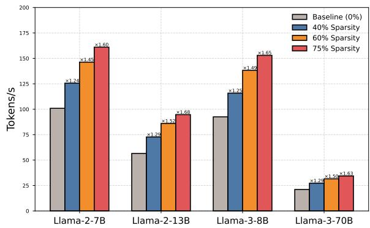  
Figure 4: End-to-end single-batch inference speed (tokens per second).

## 4.4 Experiments on Hardware Acceleration

We benchmark the end-to-end, single-batch decoding speed of WAS on the A800 GPU. Following the standard inference benchmarking setup in (Py-Torch, 2024), we report the averaged speedup results over five input sentences. Our experiments primarily focus on LLaMA-2 (7B, 13B) and LLaMA-3 (8B, 70B) models across 40%, 60%, and 75% sparsity levels, with Tensor Parallelism (TP2) enabled for LLaMA-3-70B. As shown in Figure 4, WAS achieves up to 1.52 and 1.68 speedups at 60% and 75% sparsity, respectively. These results demonstrate the practical effectiveness of WAS in accelerating LLM inference.

<table><tr><td>Greedy</td><td>Weight Norm</td><td>TPE</td><td>Wiki-2</td><td>C4</td></tr><tr><td>√</td><td></td><td></td><td>42.15</td><td>51.34</td></tr><tr><td>√</td><td></td><td>√</td><td>21.13</td><td>24.80</td></tr><tr><td>√</td><td>√</td><td></td><td>19.21</td><td>21.24</td></tr><tr><td>√</td><td>√</td><td>√</td><td>12.76</td><td>15.56</td></tr></table>

Table 3: Ablation results of LLaMA-2-7B at 75% sparsity levels.
<table><tr><td>Model</td><td>Method</td><td>Wiki-2</td><td>C4</td></tr><tr><td rowspan="2">LLaMA-2-7B</td><td>w/o constraint</td><td>13.79</td><td>17.28</td></tr><tr><td>constraint</td><td>12.76</td><td>15.56</td></tr><tr><td rowspan="2">LLaMA-2-13B</td><td>w/o constraint</td><td>8.57</td><td>11.60</td></tr><tr><td>constraint</td><td>8.16</td><td>11.10</td></tr></table>

Table 4: Results with and without constrained optimization at 75% sparsity levels for LLaMA-2 (7B, 13B).

## 4.5 Ablation Experiments

To comprehensively validate our proposed Weight-Aware Activation Sparsity and the constrained TPE optimization for inter-block sparsity allocation, we conduct ablation studies on LLaMA2-7B at 75% sparsity levels and results are presented in Table 3. The first row of the table replicates TEAL’s approach, employing a uniform sparsity distribution with greedy intra-block optimization. The results in the second and third rows demonstrate the benefits of our proposed enhancements: using constrained TPE for inter-block sparsity alone reduces perplexity by 21.02 and 26.54 on WikiText2 and C4, respectively, while applying WAS under uniform sparsity achieves reductions of 22.94 and 30.10. These findings highlight the individual advantages of each point. Notably, the combined approach, integrating both techniques, yields the most substantial improvement, underscoring the necessity of hierarchical sparsity allocation and reaffirming the importance of weight information in the sparsification process.

Furthermore, we conducted experiments to validate the effectiveness of our constrained TPE approach. As shown in Table 4, at 75% sparsity level, we compared unconstrained TPE (allowing arbitrary sparsity distribution across blocks) with our constrained version on both LLaMA-2-7B and LLaMA-2-13B. While unconstrained TPE theoretically offers greater optimization potential, empirical results demonstrate our constrained method achieves superior performance. This phenomenon may stem from the inherent limitations of Bayesian optimization in high-dimensional search spaces, where the algorithm becomes increasingly prone to convergence at local optima rather than the global optimum as the dimensionality expands. Crucially, the unconstrained TPE significantly slows convergence due to difficulty maintaining target sparsity - LLaMA-2-13B required over 100 trials versus just 50 for the constrained version. This improvement suggests our constraints effectively reduce optimization dimensionality, addressing Bayesian optimization’s instability in high-dimensional spaces while simultaneously accelerating convergence and enhancing final performance.

## 5 Conclusion

In this paper, we propose WAS, a novel trainingfree activation sparsity framework. WAS introduces a new sparsification strategy that incorporates weight importance into the thresholding decision, addressing a key limitation of prior magnitude-only approaches. To further improve sparsity allocation, we employ a constrained Bayesian optimization method that assigns blockwise sparsity rates in a monotonically increasing fashion. Finally, we design a custom GPU kernel to realize end-to-end inference acceleration under the WAS sparsity patterns. Experimental results demonstrate that WAS achieves performance comparable to strong baselines at sparsity levels below 60%, and establishes new state-of-the-art results under the more challenging 75% sparsity setting.

## Limitations

While WAS incorporates weight information into the activation sparsification process and leverages constrained Bayesian optimization to assign blockwise sparsity rates, our current design primarily targets LLMs whose activation distributions are symmetric and unimodal around zero. In future work, we plan to extend our method to a broader range of model architectures. Additionally, due to limited hardware resources, our focus has been on training-free scenarios. Incorporating training into the WAS framework remains a promising direction for further improving performance.

## Ethics Statement

This paper presents a training-free activation sparsity framework designed to improve the inference efficiency of LLMs, with the broader aim of enabling more accessible and sustainable deployment of LLMs in real-world settings. We are aware of ongoing ethical discussions surrounding LLMs, particularly regarding fairness, bias amplification, and environmental impact. Our proposed method focuses solely on sparsifying activation patterns during inference without modifying model weights or introducing new training data. As such, we believe that WAS does not exacerbate existing biases nor introduce additional ethical risks.

## Acknowledgments

Miao Zhang was partially sponsored by the National Natural Science Foundation of China under Grant 62306084 and U23B2051, Shenzhen College Stability Support Plan under Grant GXWD20231128102243003, and Shenzhen Science and Technology Program under Grant ZDSYS20230626091203008 and KJZD20230923115113026.

## References

Saleh Ashkboos, Maximilian L Croci, Marcelo Gennari do Nascimento, Torsten Hoefler, and James Hensman. 2024. Slicegpt: Compress large language models by deleting rows and columns. arXiv preprint arXiv:2401.15024.

Yoshua Bengio, Nicholas Léonard, and Aaron Courville. 2013. Estimating or propagating gradients through stochastic neurons for conditional computation. arXiv preprint arXiv:1308.3432.

James Bergstra, Rémi Bardenet, Yoshua Bengio, and Balázs Kégl. 2011. Algorithms for hyper-parameter optimization. Advances in neural information processing systems, 24.

Yonatan Bisk, Rowan Zellers, Jianfeng Gao, Yejin Choi, and 1 others. 2020. Piqa: Reasoning about physical commonsense in natural language. In Proceedings of the AAAI conference on artificial intelligence, volume 34, pages 7432–7439.

Tom Brown, Benjamin Mann, Nick Ryder, Melanie Subbiah, Jared D Kaplan, Prafulla Dhariwal, Arvind Neelakantan, Pranav Shyam, Girish Sastry, Amanda Askell, and 1 others. 2020. Language models are few-shot learners. Advances in neural information processing systems, 33:1877–1901.

Xuanyao Chen, Zhijian Liu, Haotian Tang, Li Yi, Hang Zhao, and Song Han. 2023. Sparsevit: Revisiting activation sparsity for efficient high-resolution vision transformer. In Proceedings of the IEEE/CVF conference on computer vision and pattern recognition, pages 2061–2070.

Aakanksha Chowdhery, Sharan Narang, Jacob Devlin, Maarten Bosma, Gaurav Mishra, Adam Roberts, Paul

Barham, Hyung Won Chung, Charles Sutton, Sebastian Gehrmann, and 1 others. 2023. Palm: Scaling language modeling with pathways. Journal ofMachine Learning Research, 24(240):1–113.

Peter Clark, Isaac Cowhey, Oren Etzioni, Tushar Khot, Ashish Sabharwal, Carissa Schoenick, and Oyvind Tafjord. 2018. Think you have solved question answering? try arc, the ai2 reasoning challenge. arXiv preprint arXiv:1803.05457.

Karl Cobbe, Vineet Kosaraju, Mohammad Bavarian, Mark Chen, Heewoo Jun, Lukasz Kaiser, Matthias Plappert, Jerry Tworek, Jacob Hilton, Reiichiro Nakano, and 1 others. 2021. Training verifiers to solve math word problems. arXiv preprint arXiv:2110.14168.

Harry Dong, Beidi Chen, and Yuejie Chi. 2024. Promptprompted adaptive structured pruning for efficient llm generation. arXiv preprint arXiv:2404.01365.

Alexey Dosovitskiy, Lucas Beyer, Alexander Kolesnikov, Dirk Weissenborn, Xiaohua Zhai, Thomas Unterthiner, Mostafa Dehghani, Matthias Minderer, Georg Heigold, Sylvain Gelly, and 1 others. 2020. An image is worth 16x16 words: Transformers for image recognition at scale. arXiv preprint arXiv:2010.11929.

Elias Frantar, Saleh Ashkboos, Torsten Hoefler, and Dan Alistarh. 2022. Gptq: Accurate post-training quantization for generative pre-trained transformers. arXiv preprint arXiv:2210.17323.

Leo Gao, Jonathan Tow, Baber Abbasi, Stella Biderman, Sid Black, Anthony DiPofi, Charles Foster, Laurence Golding, Jeffrey Hsu, Alain Le Noac’h, Haonan Li, Kyle McDonell, Niklas Muennighoff, Chris Ociepa, Jason Phang, Laria Reynolds, Hailey Schoelkopf, Aviya Skowron, Lintang Sutawika, and 5 others. 2024. A framework for few-shot language model evaluation.

Aaron Grattafiori, Abhimanyu Dubey, Abhinav Jauhri, Abhinav Pandey, Abhishek Kadian, Ahmad Al-Dahle, Aiesha Letman, Akhil Mathur, Alan Schelten, Alex Vaughan, and 1 others. 2024. The llama 3 herd of models. arXiv preprint arXiv:2407.21783.

Matteo Grimaldi, Darshan C Ganji, Ivan Lazarevich, and Sudhakar Sah. 2023. Accelerating deep neural networks via semi-structured activation sparsity. In Proceedings ofthe IEEE/CVF International Conference on Computer Vision, pages 1179–1188.

Dan Hendrycks, Collin Burns, Steven Basart, Andy Zou, Mantas Mazeika, Dawn Song, and Jacob Steinhardt. 2020. Measuring massive multitask language understanding. arXiv preprint arXiv:2009.03300.

Albert Q. Jiang, Alexandre Sablayrolles, Arthur Mensch, Chris Bamford, Devendra Singh Chaplot, Diego de las Casas, Florian Bressand, Gianna Lengyel, Guillaume Lample, Lucile Saulnier, Lelio Renard Lavaud, Marie-Anne Lachaux, Pierre Stock, Teven Le Scao,

Thibaut Lavril, Thomas Wang, Timothee Lacroix, and William El Sayed. 2023. Mistral 7b.

Bo-Kyeong Kim, Geonmin Kim, Tae-Ho Kim, Thibault Castells, Shinkook Choi, Junho Shin, and Hyoung-Kyu Song. 2024. Shortened llama: A simple depth pruning for large language models. arXiv preprint arXiv:2402.02834, 11.

Mark Kurtz, Justin Kopinsky, Rati Gelashvili, Alexander Matveev, John Carr, Michael Goin, William Leiserson, Sage Moore, Nir Shavit, and Dan Alistarh. 2020. Inducing and exploiting activation sparsity for fast inference on deep neural networks. In International Conference on Machine Learning, pages 5533–5543. PMLR.

Donghyun Lee, Je-Yong Lee, Genghan Zhang, Mo Tiwari, and Azalia Mirhoseini. 2024. Cats: Contextually-aware thresholding for sparsity in large language models. arXiv preprint arXiv:2404.08763.

Zonglin Li, Chong You, Srinadh Bhojanapalli, Daliang Li, Ankit Singh Rawat, Sashank J Reddi, Ke Ye, Felix Chern, Felix Yu, Ruiqi Guo, and 1 others. 2022. The lazy neuron phenomenon: On emergence of activation sparsity in transformers. arXiv preprint arXiv:2210.06313.

James Liu, Pragaash Ponnusamy, Tianle Cai, Han Guo, Yoon Kim, and Ben Athiwaratkun. 2024. Trainingfree activation sparsity in large language models. Preprint, arXiv:2408.14690.

Zichang Liu, Jue Wang, Tri Dao, Tianyi Zhou, Binhang Yuan, Zhao Song, Anshumali Shrivastava, Ce Zhang, Yuandong Tian, Christopher Re, and 1 others. 2023. Deja vu: Contextual sparsity for efficient llms at inference time. In International Conference on Machine Learning, pages 22137–22176. PMLR.

Chi Ma, Mincong Huang, Ying Zhang, Chao Wang, Yujie Wang, Lei Yu, Chuan Liu, and Wei Lin. 2024. First activations matter: Training-free methods for dynamic activation in large language models. arXiv preprint arXiv:2408.11393.

Xinyin Ma, Gongfan Fang, and Xinchao Wang. 2023. Llm-pruner: On the structural pruning of large language models. Advances in neural information processing systems, 36:21702–21720.

Xin Men, Mingyu Xu, Qingyu Zhang, Bingning Wang, Hongyu Lin, Yaojie Lu, Xianpei Han, and Weipeng Chen. 2024. Shortgpt: Layers in large language models are more redundant than you expect. arXiv preprint arXiv:2403.03853.

Stephen Merity, Caiming Xiong, James Bradbury, and Richard Socher. 2016. Pointer sentinel mixture models. arXiv preprint arXiv:1609.07843.

Iman Mirzadeh, Keivan Alizadeh, Sachin Mehta, Carlo C Del Mundo, Oncel Tuzel, Golnoosh Samei, Mohammad Rastegari, and Mehrdad Farajtabar. 2023. Relu strikes back: Exploiting activation

sparsity in large language models. arXiv preprint arXiv:2310.04564.

Team PyTorch. 2024. Accelerating generative ai with pytorch ii: Gpt, fast. https://pytorch.org/blog/ accelerating-generative-ai-2/. Accessed: 2024-04-29.

Colin Raffel, Noam Shazeer, Adam Roberts, Katherine Lee, Sharan Narang, Michael Matena, Yanqi Zhou, Wei Li, and Peter J Liu. 2020a. Exploring the limits of transfer learning with a unified text-to-text transformer. Journal ofmachine learning research, 21(140):1–67.

Colin Raffel, Noam Shazeer, Adam Roberts, Katherine Lee, Sharan Narang, Michael Matena, Yanqi Zhou, Wei Li, and Peter J Liu. 2020b. Exploring the limits of transfer learning with a unified text-to-text transformer. Journal ofmachine learning research, 21(140):1–67.

Md Aamir Raihan and Tor Aamodt. 2020. Sparse weight activation training. Advances in Neural Information Processing Systems, 33:15625–15638.

Keisuke Sakaguchi, Ronan Le Bras, Chandra Bhagavatula, and Yejin Choi. 2021. Winogrande: An adversarial winograd schema challenge at scale. Communications ofthe ACM, 64(9):99–106.

Wenqi Shao, Mengzhao Chen, Zhaoyang Zhang, Peng Xu, Lirui Zhao, Zhiqian Li, Kaipeng Zhang, Peng Gao, Yu Qiao, and Ping Luo. 2023. Omniquant: Omnidirectionally calibrated quantization for large language models. arXiv preprint arXiv:2308.13137.

Noam Shazeer. 2020. Glu variants improve transformer. arXiv preprint arXiv:2002.05202.

Chenyang Song, Xu Han, Zhengyan Zhang, Shengding Hu, Xiyu Shi, Kuai Li, Chen Chen, Zhiyuan Liu, Guangli Li, Tao Yang, and 1 others. 2024. Prosparse: Introducing and enhancing intrinsic activation sparsity within large language models. arXiv preprint arXiv:2402.13516.

Mingjie Sun, Zhuang Liu, Anna Bair, and J Zico Kolter. 2023. A simple and effective pruning approach for large language models. arXiv preprint arXiv:2306.11695.

Rohan Taori, Ishaan Gulrajani, Tianyi Zhang, Yann Dubois, Xuechen Li, Carlos Guestrin, Percy Liang, and Tatsunori B. Hashimoto. 2023. Stanford alpaca: An instruction-following llama model. https:// github.com/tatsu-lab/stanford\_alpaca.

Philippe Tillet, Hsiang-Tsung Kung, and David Cox. 2019. Triton: an intermediate language and compiler for tiled neural network computations. In Proceedings of the 3rd ACM SIGPLAN International Workshop on Machine Learning and Programming Languages, pages 10–19.

Hugo Touvron, Louis Martin, Kevin Stone, Peter Albert, Amjad Almahairi, Yasmine Babaei, Nikolay Bashlykov, Soumya Batra, Prajjwal Bhargava, Shruti Bhosale, and 1 others. 2023. Llama 2: Open foundation and fine-tuned chat models. arXiv preprint arXiv:2307.09288.

Lu Yin, You Wu, Zhenyu Zhang, Cheng-Yu Hsieh, Yaqing Wang, Yiling Jia, Gen Li, Ajay Jaiswal, Mykola Pechenizkiy, Yi Liang, and 1 others. 2023. Outlier weighed layerwise sparsity (owl): A missing secret sauce for pruning llms to high sparsity. arXiv preprint arXiv:2310.05175.

Rowan Zellers, Ari Holtzman, Yonatan Bisk, Ali Farhadi, and Yejin Choi. 2019. Hellaswag: Can a machine really finish your sentence? arXiv preprint arXiv:1905.07830.

Susan Zhang, Stephen Roller, Naman Goyal, Mikel Artetxe, Moya Chen, Shuohui Chen, Christopher Dewan, Mona Diab, Xian Li, Xi Victoria Lin, and 1 others. 2022. Opt: Open pre-trained transformer language models. arXiv preprint arXiv:2205.01068.

Zhengyan Zhang, Yixin Song, Guanghui Yu, Xu Han, Yankai Lin, Chaojun Xiao, Chenyang Song, Zhiyuan Liu, Zeyu Mi, and Maosong Sun. 2024. Relu<sup>2</sup> wins: Discovering efficient activation functions for sparse llms. arXiv preprint arXiv:2402.03804.

Yilong Zhao, Chien-Yu Lin, Kan Zhu, Zihao Ye, Lequn Chen, Size Zheng, Luis Ceze, Arvind Krishnamurthy, Tianqi Chen, and Baris Kasikci. 2024. Atom: Lowbit quantization for efficient and accurate llm serving. Proceedings ofMachine Learning and Systems, 6:196–209.

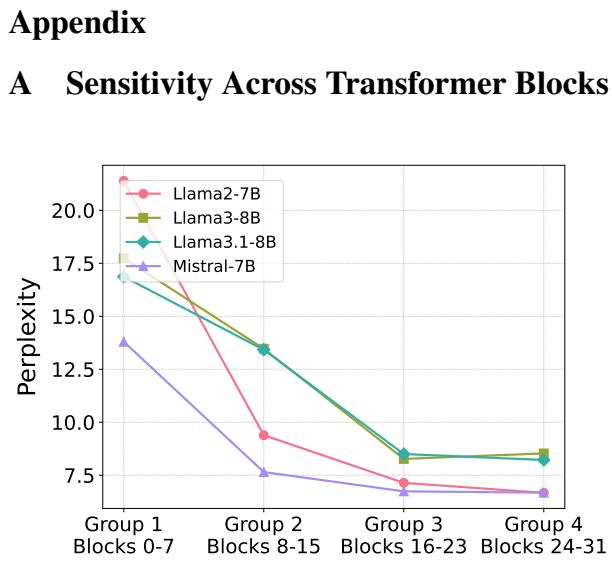  
Figure 5: We divide the transformer into four contiguous block groups (8 blocks each) and evaluate perplexity when sparsifying one group to 80% while others remain at 60% .

We partition the transformer into four contiguous block groups (8 blocks each) and evaluate perplexity by setting one group’s sparsity to 80% while keeping the remaining groups at 60%. As shown in Figure 5, the trend in perplexity changes is opposite to that observed when sparsifying one group to 60% with others at 80%. Specifically, increasing sparsity in shallow blocks substantially deteriorates performance, whereas increasing sparsity in deeper blocks has a limited effect. This further confirms that transformer blocks at different positions exhibit varying sensitivities to sparsity, with shallower blocks being notably more sensitive.

## B Effect of Weight Norm on Activation Distributions

We visualize the activation distributions of additional models after incorporating weight norm. As shown in Figures 6, 7 and 8, we observe that the distribution shape of activations remains largely unchanged after being scaled by weight norms. This may be due to the weight norm applying only a scale transformation without altering the distribution’s shape. This stability facilitates threshold determination at a given sparsity level.

## C Extended Results at 40% Sparsity

As demonstrated in Table 5, both WAS and TEAL surpass WANDA at 40% sparsity level, reconfirming the superiority of activation sparsity over conventional weight pruning. The marginal improvement of WAS over TEAL at this sparsity level suggests the model’s intrinsic low-sparsity property may inherently limit the optimization headroom. It is worth noting that we omit the results of CATS under 40% sparsity, as its performance has completely degraded at this level.

<table><tr><td>Models</td><td>Methods</td><td>ARC-C</td><td>ARC-E</td><td>HellaSwag</td><td>PIQA</td><td>Winogrande</td><td>GSM8K</td><td>MMLU</td><td>AVG</td></tr><tr><td rowspan="3">LLaMA-2-7B</td><td>WANDA</td><td>42.66</td><td>75.59</td><td>55.59</td><td>77.26</td><td>69.93</td><td>8.34</td><td>38.16</td><td>52.50</td></tr><tr><td>TEAL</td><td>43.00</td><td>75.63</td><td>56.40</td><td>77.69</td><td>68.59</td><td>12.05</td><td>43.79</td><td>53.87</td></tr><tr><td>WAS</td><td>43.69</td><td>75.84</td><td>56.92</td><td>77.75</td><td>67.64</td><td>12.36</td><td>44.50</td><td>54.10</td></tr><tr><td rowspan="3">LLaMA-2-13B</td><td>WANDA</td><td>46.59</td><td>78.54</td><td>59.27</td><td>78.45</td><td>72.22</td><td>18.35</td><td>50.90</td><td>57.76</td></tr><tr><td>TEAL</td><td>47.95</td><td>78.62</td><td>60.02</td><td>78.45</td><td>71.67</td><td>20.55</td><td>54.25</td><td>58.79</td></tr><tr><td>WAS</td><td>48.81</td><td>78.58</td><td>60.25</td><td>79.22</td><td>72.06</td><td>22.52</td><td>54.18</td><td>59.37</td></tr><tr><td rowspan="3">LLaMA-3-8B</td><td>WANDA</td><td>48.16</td><td>75.93</td><td>56.53</td><td>77.80</td><td>73.09</td><td>31.31</td><td>59.03</td><td>60.26</td></tr><tr><td>TEAL</td><td>48.89</td><td>79.17</td><td>59.08</td><td>79.87</td><td>72.30</td><td>43.82</td><td>63.03</td><td>63.74</td></tr><tr><td>WAS</td><td>49.66</td><td>78.41</td><td>59.04</td><td>78.89</td><td>71.59</td><td>44.20</td><td>62.98</td><td>63.54</td></tr><tr><td rowspan="3">LLaMA-3.1-8B</td><td>WANDA</td><td>48.04</td><td>77.90</td><td>56.81</td><td>77.80</td><td>72.45</td><td>32.15</td><td>60.52</td><td>60.81</td></tr><tr><td>TEAL</td><td>49.83</td><td>79.88</td><td>59.00</td><td>79.38</td><td>71.98</td><td>43.82</td><td>63.59</td><td>63.93</td></tr><tr><td>WAS</td><td>48.72</td><td>80.60</td><td>59.16</td><td>79.00</td><td>71.35</td><td>45.56</td><td>63.79</td><td>64.03</td></tr><tr><td rowspan="3">Mistral-7B</td><td>WANDA</td><td>46.76</td><td>78.24</td><td>59.10</td><td>79.76</td><td>72.53</td><td>26.61</td><td>58.78</td><td>60.25</td></tr><tr><td>TEAL</td><td>49.15</td><td>79.59</td><td>61.20</td><td>79.98</td><td>72.85</td><td>36.85</td><td>61.57</td><td>63.03</td></tr><tr><td>WAS</td><td>49.74</td><td>80.39</td><td>61.22</td><td>79.98</td><td>73.56</td><td>35.41</td><td>61.37</td><td>63.10</td></tr></table>

Table 5: Comparative analysis of zero-shot and fewshot performance(higher is better) across LLaMA and Mistral model families at 40% sparsity levels.

## D Intra-Block Sparsity Allocation By Greedy Search

Algorithm 2 Layer-wise Greedy Sparsity Assign  
ment   
Input: Block B, sparsity increment α, input $\mathbf { X } \in \mathbb { R } ^ { 1 }$ B seq d   
with n matrices, target sparsity t   
1: for i = 1 to n do   
2: $f _ { i } \gets \mathrm { s i z e } ( W _ { i } )$   
3: end for   
4: $\textstyle F \gets \sum _ { i = 1 } ^ { n } f _ { i }$   
5: $\mathbf { p }  \mathbf { \overline { { 0 _ { n } } } } , \mathbf { \bar { \mathit { P } } }  0$ ▷ Initialize sparsity settings   
6: $\mathbf { Y } _ { \mathrm { t a r g e t } }  B ( \mathbf { X } )$   
7: while $P < t$ do   
8: for i = 1 to n do   
9: $\begin{array} { r } { \Delta _ { i }  \alpha \cdot ( \frac { F } { f _ { i } } ) } \end{array}$   
10: $\mathbf { p } _ { . } ^ { \prime }  \mathbf { p }$   
11: $\bar { p } _ { i } ^ { \prime } \gets \bar { p } _ { i } + \Delta _ { i }$   
12: $\widehat { \mathbf { Y } } _ { i } \gets B ( \mathbf { X } , \mathbf { p } ^ { \prime } )$   
13: $E _ { i }  \Vert \mathbf { Y } _ { \mathrm { t a r g e t } } - \widehat { \mathbf { Y } } _ { i } \Vert _ { 2 }$   
14: end for   
▷ Update sparsity for the least-error matrix   
15: <sup>j</sup> ← <sup>arg</sup> <sup>min</sup>i $E _ { i }$   
16: $p _ { j }  { } p _ { j } + \Delta _ { j }$   
17: $\begin{array} { r } { \dot { P } \gets \sum _ { i = 1 } ^ { n } \left( \boldsymbol { \dot { p } _ { i } } \cdot \boldsymbol { f _ { i } } \right) / F } \end{array}$ ▷ Record sparsity   
configuration   
18: end while

As shown in Algorithm 2, our greedy algorithm for intra-block sparsity optimization operates through three key phases: (1) Initialization with componentwise parameter ratios relative to the block, (2) Iterative sparsity increment by step size α, where each step allocates sparsity to the component yielding minimal MSE degradation, and (3) Convergence to the target sparsity with optimal component-level distribution.

-4 -2 0 2

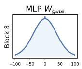

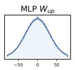

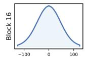

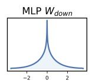

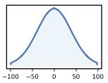

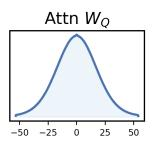

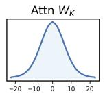

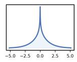

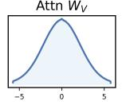

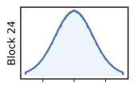

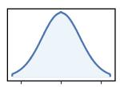

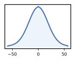

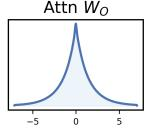

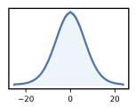

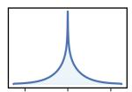

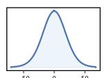

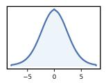

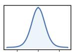

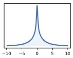

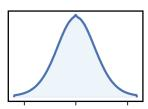

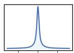  
Figure 6: Distributions of activations (after being scaled by the corresponding weight norm) in Blocks 8, 16, and 24 of LLaMA-3.1-8B exhibit symmetric and unimodal around zero.

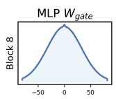

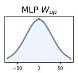

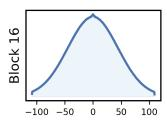

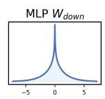

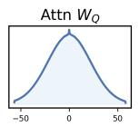

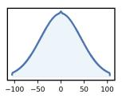

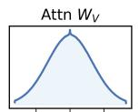

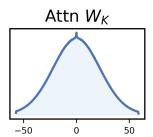

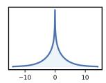

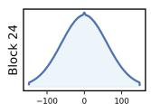

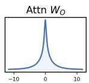

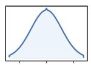

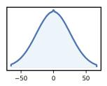

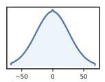

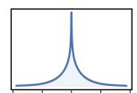

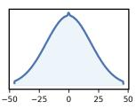

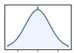

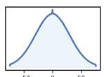

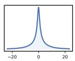

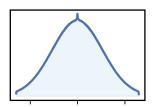

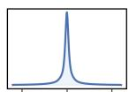  
-20 0 20

Figure 7: Distributions of activations (after being scaled by the corresponding weight norm) in Blocks 8, 16, and 24 of LLaMA-2-7B exhibit symmetric and unimodal around zero.  
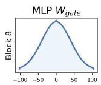

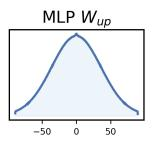


  
Figure 8: Distributions of activations (after being scaled by the corresponding weight norm) in Blocks 8, 16, and 24 of Mistral-7B exhibit symmetric and unimodal around zero.