# $\mathbf { T } ^ { 2 }$ : An Adaptive Test-Time Scaling Strategy for Contextual Question Answering

Zhengyi Zhao1,5\*, Shubo Zhang2\*, Zezhong Wang1,5, Huimin Wang3, Yutian Zhao3, Bin Liang1,5, Yefeng Zheng4, Binyang Li2†, Kam-Fai Wong1,5, Xian Wu3†

1 The Chinese University of Hong Kong 2 University of International Relations 3 Tencent Jarvis Lab 4 Westlake University

5 Ministry of Education Key Laboratory of High Confidence Software Technologies, CUHK {zyzhao,kfwong}@se.cuhk.edu.hk, byli@uir.edu.cn, kevinxwu@tencent.com

## Abstract

Recent advances in Large Language Models (LLMs) have demonstrated remarkable performance in Contextual Question Answering (CQA). However, prior approaches typically employ elaborate reasoning strategies regardless of question complexity, leading to low adaptability. Recent efficient test-time scaling methods introduce budget constraints or early stop mechanisms to avoid overthinking for straightforward questions. But they add human bias to the reasoning process and fail to leverage models’ inherent reasoning capabilities. To address these limitations, we present $\mathrm { T ^ { 2 } } ;$ Think-to-Think, a novel framework that dynamically adapts reasoning depth based on question complexity. $\mathrm { T ^ { 2 } }$ leverages the insight that if an LLM can effectively solve similar questions using specific reasoning strategies, it can apply the same strategy to the original question. This insight enables the adoption of concise reasoning for straightforward questions while maintaining detailed analysis for complex problems. $\mathrm { T ^ { 2 } }$ works through four key steps: decomposing questions into structural elements, generating similar examples with candidate reasoning strategies, evaluating these strategies against multiple criteria, and applying the most appropriate strategy to the original question. Experimental evaluation across seven diverse CQA benchmarks demonstrates that $\mathrm { T ^ { 2 } }$ not only achieves higher accuracy than baseline methods but also reduces computational overhead by up to 25.2%.

## 1 Introduction

Large language models (LLMs) have demonstrated impressive capabilities in Contextual Question Answering (CQA) tasks (Trivedi et al., 2023; Press et al., 2023), but their reasoning approaches often lack adaptability to question complexity. Current

CQA systems typically employ either direct answer generation or elaborate step-by-step reasoning for all questions, regardless of difficulty (Wei et al., 2022; Huang et al., 2024; Min et al., 2024). This one-size-fits-all approach has an accuracy-vsefficiency delimma. Directly generating answers for all questions will deteriorate the performance on difficult questions, which require multi-hop reasoning. Elaborated reasoning for all questions creates an efficiecy challenge: models frequently generate reasoning chains that are excessively verbose, containing redundant steps that do not contribute to finding the correct answer.

Existing analysis reveals that these redundant reasoning paths can unnecessarily extend the length of reasoning chains multiple times beyond what is required. Such as exploring multiple solution approaches when only one is needed (Ji et al., 2025), or verifying simple facts with elaborate explanations (Muennighoff et al., 2025). For example, when asked “What is the capital of France?”, models often generate lengthy discussions about France’s history and geography before providing the straightforward answer “Paris.” This computational inefficiency is particularly concerning as model deployment costs continue to rise. Recent studies on reasoning efficiency (Yang et al., 2025; Zeng et al., 2025) confirm that blindly increasing reasoning chain length can actually harm performance on simpler tasks. Various attempts have been made to address this through adding a budget or stop mechanism to test-time scaling (TTS) methods (Wei et al., 2022; Huang et al., 2024) to stop thinking early, but these approaches introduce a human bias to the reasoning process (Yuan et al., 2023) and fail to leverage the model’s inherent reasoning abilities.

Hence, the fundamental challenge is to develop a reasoning mechanism that can dynamically adjust its computational effort based on question complexity, which means providing concise reasoning for straightforward questions while maintaining detailed analysis for complex problems. Therefore, we present $\mathrm { T ^ { 2 } }$ , a think-to-think framework for efficient TTS strategy. $\mathrm { T ^ { 2 } }$ leverages a key insight: if an LLM can effectively solve similar questions using specific reasoning strategies, it can apply comparable strategies to the original question. The process involves four key steps: (1) Decomposing the original question into its structural elements. For example, given the question:

[Given Reference Documents]

## “Which is taller, the Eiffel Tower or the Empire State Building?”

T2 would identify this as a comparative question involving measurement between two specific places as “Which is [adj], [place 1] or [place $2 ] ? { } ^ { \ ' }$ . (2) Creating a diverse set of similar example questions with the same question structure, each paired with supporting documents and potential reasoning strategies. Each reasoning strategy breaks down similar questions into simpler steps using fundamental reasoning skills (e.g., decomposing similar question “Which is taller, Building A or Building B?” into subquestions about individual heights connected by deductive reasoning for comparison). (3) Evaluating these reasoning strategies using multiple criteria to select the most appropriate strategy for the original question. (4) Applying the selected reasoning strategy to the original question while filtering irrelevant information.

By learning from similar examples, the model develops a more nuanced understanding of when detailed reasoning is necessary and when a more direct approach is sufficient. This allows $\mathrm { T ^ { 2 } }$ to balance accuracy and efficiency without relying on pre-determined reasoning templates.

We evaluate $\mathrm { T ^ { 2 } }$ across seven diverse CQA datasets ranging from simple factual queries to complex multi-hop reasoning tasks. Our results demonstrate that ${ \bar { \mathrm { T } } } ^ { 2 }$ achieves superior accuracy (up to a 21.3% increase) compared to other TTS approaches while reducing computational requirements by up to 25.2%. These efficiency gains are particularly clear for simpler questions where redundant reasoning steps are eliminated. While for complex questions, $\mathrm { T ^ { 2 } }$ maintains the reasoning depth required for accuracy without exploring unnecessary paths.

Our contributions include:

• We introduce $\mathrm { T ^ { 2 } }$ , a framework that enables language models to dynamically select appropriate reasoning strategies through similar examples, balancing efficiency and thoroughness based on question complexity.

• We develop a multi-criteria selection method that evaluates potential reasoning strategies based on coverage and uniqueness, ensuring the most suitable approach is applied to each question.

• We demonstrate through extensive experiments across diverse CQA benchmarks that our method reduces computational requirements by up to 25.2% with superior accuracy.

## 2 Related Work

Contextual QA. In addressing contextual QA, recent works have explored multi-round retrieval or reasoning approaches, including query rewriting for subsequent retrievals (Khattab et al., 2022; Ma et al., 2023; Shao et al., 2023; Jiang et al., 2023), alternating between retrieval and reasoning steps (Trivedi et al., 2023), and employing multiround self-asking techniques (Press et al., 2023). They all rely on LLMs’ reasoning abilities. We also discuss the application scope in Appendix B.1.

Test-Time Scaling. Recent approaches to enhancing LLM reasoning capabilities focus on increasing computational resources during inference (Brown et al., 2024; Chen et al., 2024), termed test-time scaling. These methods includes majority voting (Wang et al., 2022), weighted aggregation (Li et al., 2023), best-of-N (Lightman et al., 2023), Tree-of-Thoughts (Yao et al., 2023), and Monte Carlo Tree Search variants (Wu et al., 2024; Zhang et al., 2024a; Zhao et al., 2024). Besides, o1 model (Jaech et al., 2024) and several followup works (Guo et al., 2025; Qwen, 2024; Gemini, 2025a; Min et al., 2024; Huang et al., 2024) increase the thinking depth to improve the performance. But they all apply fixed scaling strategies to all questions. Some adaptive thinking methods like AdoT (Xu et al., 2024) and DAST (Shen et al., 2025) design difficulty measurement to categorize the question based on its difficulty, whereas they introduce human bias and fail to leverage the model’s inherent reasoning abilities. Our $\mathrm { T ^ { 2 } }$ framework builds upon this paradigm while addressing these key limitations.

## 3 T2: Think-to-Think Framework

In this section, we present $\mathrm { T ^ { 2 } } { \mathrm { : } }$ : Think-to-Think, an approach that enables language models to adapt their reasoning strategies based on question complexity. Figure 1 provides an overview of our approach. We begin by describing the overall architecture and workflow of $\mathrm { \ddot { T } ^ { 2 } }$ before delving into each component in detail.

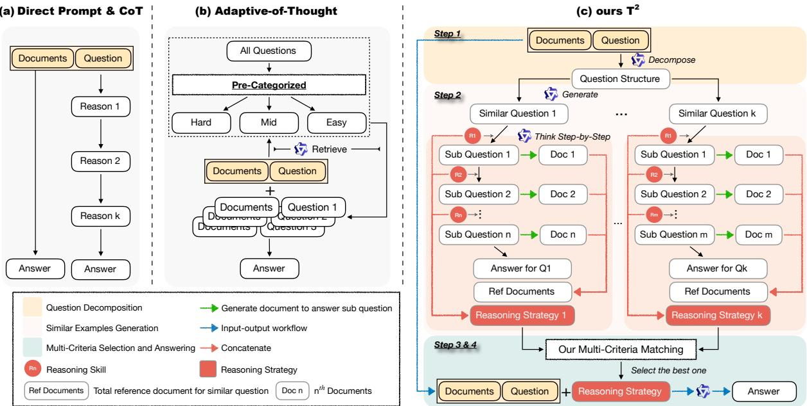  
Figure 1: Overview of our ${ \mathrm { T } } ^ { 2 } .$ (a) direct prompt or Chain-of-Thought (CoT), which adopts the same reasoning strategy regardless of question complexity. (b) Adaptive-of-Thought, which designs a question complexity evaluator to pre-categorize all questions, which might bring human bias in the evaluator design process. (c) our $\dot { \mathrm { T } } ^ { 2 }$ . Instead of pre-categorizing questions into different complexity sets, $\mathrm { T ^ { 2 } }$ generates multiple similar examples for different inputs adaptively and selects the best reasoning strategy for answering.

## 3.1 Question Decomposition

Given a document D and a question Q, we first analyze the question’s structure to understand its underlying pattern. This allows us to later generate similar questions that require same reasoning strategy. The question structure identification process involves decomposing the question into fixed structural elements and variable entities that could be substituted.

We first tokenize the question Q as a sequence of tokens $Q = ( q _ { 1 } , q _ { 2 } , \dots , q _ { m } )$ . We then classify each token into one of two categories: structural tokens that form the question’s framework, and replaceable entities that could be substituted with alternatives. We define a classification function with fine-tuned RoBERTa, detailed in Appendix D. Based on this classification, we partition the question tokens into two sets:

$$
P = \{ q _ { i } | { \mathrm { i f } } q _ { i } { \mathrm { i s } } { \mathrm { a r e p l a c e a b l e } } { \mathrm { e n t i t y } } \} ,\tag{1}
$$

$$
Q _ { S } = \{ q _ { i } | { \mathrm { ~ i f ~ } } q _ { i } { \mathrm { ~ i s ~ a ~ s t r u c t u r a l ~ t o k e n } } \} ,\tag{2}
$$

where P represents the set of replaceable entities

(which we call entity placeholders), and $Q _ { S }$ represents the set of structural tokens that form the question’s framework.

For each identified entity placeholder $p _ { i }$ in $P ,$ we assign a semantic type (e.g., person, location, date). This creates a set of typed entities:

$$
T = \{ ( p _ { 1 } , \tau _ { 1 } ) , ( p _ { 2 } , \tau _ { 2 } ) , \ldots , ( p _ { k } , \tau _ { k } ) \} ,\tag{3}
$$

where each pair $( p _ { j } , \tau _ { j } )$ consists of a placeholder entity $p _ { j }$ and its corresponding type $\tau _ { j }$

By combining the structure tokens $Q _ { S }$ with the typed placeholders in T, we create a question template. For example, if Q is “Which is taller, the Eiffel Tower or the Empire State Building $? ^ { \dag }$ , the function would identify “taller”, “Eiffel Tower”, and “Empire State Building” as replaceable entities of type adj and place. The resulting template would be “Which is [adj], [place 1] or [place 2]?”, where the bracketed terms are typed placeholders.

## 3.2 Similar Examples Generation

Once we have extracted the question structure, we generate similar document-question-answer pairs that follow the same question structure but with different entities.

Reasoning Skills Taxonomy. We build on established cognitive science literature (Bartha, 2013;

Bordalo et al., 2024) to define a taxonomy of 7 fundamental reasoning skills that humans commonly employ when solving problems (e.g., Deductive, Inductive1). Each skill represents a distinct cognitive approach to processing information and drawing conclusions.

Question Generation. For each placeholder in the question structure, we generate alternative entities of matching types. We prompt an LLM to suggest contextually appropriate substitutes for each entity type $\tau _ { j }$ . This produces a collection of candidate similar questions $\hat { Q } _ { \mathrm { s i m } }$ that share the structural pattern of the original question but contain different entities.

To ensure high-quality examples, we implement a validation process. We prompt the same LLM to evaluate the similarity between each candidate question and the original question structure:

$$
\sin ( Q , \hat { q } ) \geq \delta , \quad \hat { q } \in \hat { Q } _ { \sin } ,\tag{4}
$$

where $\delta \in [ 1 , 1 0 ]$ is a threshold parameter. Only questions exceeding this threshold are retained, resulting in a filtered set of similar questions $Q _ { \mathrm { s i m } }$

Reasoning Strategy Construction. For each similar question $Q _ { \mathrm { s i m } } ^ { i } \in Q _ { \mathrm { s i m } } .$ , we decompose it into a sequence of subquestions:

$$
Q _ { \sin } ^ { i }  ( Q _ { \sin } ^ { ( i , 1 ) } , \dots , Q _ { \sin } ^ { ( i , K ) } ) ,\tag{5}
$$

where each subquestion $Q _ { \mathrm { s i m } } ^ { ( i , K ) }$ represents a discrete reasoning step and K is the number of subquestions. Here the K is not a fixed constant parameter. This variation occurs because we deliberately allow the language model to determine the appropriate number of subquestions based on the specific complexity and structure of each original question. And the connections between subquestions are characterized by specific reasoning skills from our taxonomy. This decomposition allows us to construct a comprehensive reasoning strategy:

$$
\begin{array} { r } { { \bf s } ^ { i } = ( s _ { 1 } ^ { i } , s _ { 2 } ^ { i } , \dots , s _ { K } ^ { i } ) , } \end{array}\tag{6}
$$

where each $s _ { k } ^ { i } \in \mathcal S$ is the reasoning skill required to transition from subquestion $Q _ { \mathrm { s i m } } ^ { ( i , \bar { k } ) } \mathrm { t o } Q _ { \mathrm { s i m } } ^ { ( i , \bar { k } + 1 ) }$

Reference Document Generation. For each subquestion $Q _ { \mathrm { s i m } } ^ { ( i , k ) }$ , we generate a document segment $d _ { k } ^ { i }$ containing the precise information needed to

answer that subquestion. The complete reference document for question $Q _ { \mathrm { s i m } } ^ { i }$ is then constructed as:

$$
{ \cal D } _ { \mathrm { r e f } } ^ { i } = \{ d _ { 1 } ^ { i } , d _ { 2 } ^ { i } , \dots , d _ { K } ^ { i } \} .\tag{7}
$$

For example, given a similar question like “Which is taller, A or $\mathbf { B } ? ^ { \prime }$ , the decomposition might yield subquestions: “What is the height of $\mathbf { A } ? ^ { \prime }$ “What is the height of $\mathbf { B } ? ^ { \prime }$ , and “Which height is greater?”. The reasoning strategy would connect these using deductive reasoning, and the reference document would provide the necessary height information for both entities.

The complete collection of similar examples is represented as:

$$
\Gamma = \{ ( D _ { \mathrm { r e f } } ^ { i } , Q _ { \mathrm { s i m } } ^ { i } , \mathbf { s } ^ { i } ) \} _ { i = 1 } ^ { N } ,\tag{8}
$$

where N is the total number of similar examples. This diverse set covers various reasoning strategies of different complexity levels, allowing our system to later select the most appropriate reasoning approach for original questions. Detailed examples to show how subquestion and skills correspondence can be found in Appendix A.1.

## 3.3 Multi-Criteria Matching

When presented with the original question $Q$ and documents $D ,$ we need to determine which reasoning strategy would be most effective. We select the most relevant example from our similar collection Γ using a multi-criteria matching process that considers both reasoning skill requirements and structural similarity.

Skill Uniqueness Scoring. Recognizing that some reasoning skills are more specialized than others, we weight skills by their rarity in our example collection. For each reasoning skill $s \in { \mathcal { S } }$ we define freq(s) as the number of examples in Γ that include skill s in their reasoning paths. The uniqueness score of a skill is:

$$
\alpha ( s ) = \ln \left( { \frac { N + 1 } { \mathrm { f r e q } ( s ) + 1 } } \right) ,\tag{9}
$$

where $N$ is the total number of examples in our collection. This logarithmic formulation assigns higher weights to skills that appear less frequently, capturing the intuition that specialized reasoning skills deserve special consideration.

Skill Coverage Assessment. For each example in our collection, we calculate how well its reasoning path covers reasoning skills:

$$
\operatorname { c o v e r } ( \mathbf { s } ^ { i } , S ) = { \frac { | \mathbf { s } ^ { i } \cap { \mathcal { S } } | } { | S | } } .\tag{10}
$$

This coverage metric quantifies what proportion of the required reasoning skills are present in the example’s reasoning strategy.

Integrated Selection Score. We compute a comprehensive selection score for each remaining example, and the optimal example is selected as:

$$
i ^ { * } = \arg \operatorname* { m a x } _ { i } \left( \mathrm { c o v e r } ( \mathbf { s } ^ { i } , \mathcal { S } ) + \sum _ { \ell = 1 } ^ { L } \alpha ( s _ { \ell } ^ { i } ) \right) ,\tag{11}
$$

where L is the length of the reasoning strategy $\mathbf { s } ^ { i }$ This score balances how well the example covers the required reasoning skills and how uniquely it captures specialized reasoning approaches.

## 3.4 Reasoning Strategy-Guided Answering

The final component of $\mathrm { T ^ { 2 } }$ uses the selected example to guide the reasoning process for answering the original question. Algorithm 1 outlines this process.

The “ExtractRelevantSegment” function uses LLM to identify portions of the document D that are most relevant to applying a particular reasoning skill. This focuses the model’s attention on information appropriate to each step of the reasoning process. The “FormatPrompt” function combines the original question, the focused document segments, the selected reasoning strategy, and the example document-question-answer pair into a comprehensive prompt. This prompt instructs the language model to answer the original question by applying the reasoning skills in the selected strategy, using the example as a demonstration of the reasoning approach.

This methodology enables adaptive reasoning that scales with question complexity. For simple questions, $\mathrm { T ^ { 2 } }$ selects examples with a straightforward reasoning strategy, avoiding unnecessary computational overhead. For complex questions, it selects examples with a more sophisticated reasoning strategy that guides the model through the necessary steps to arrive at the correct answer. Importantly, this adaptation occurs without parameter tuning or multiple reasoning attempts, requiring only a single forward pass through the language model.

## 4 Experiments

## 4.1 Experimental Setups

Datasets. We evaluate our approach on seven QA datasets from diverse domains. SQuAD (generaldomain questions from Wikipedia) (Rajpurkar et al., 2018), HotpotQA (multihop questions spanning multiple paragraphs) (Yang et al., 2018), BioASQ (biomedical queries requiring specialized knowledge) (Tsatsaronis et al., 2015), NewsQA (news-related passages) (Trischler et al., 2017), GAOKAO (exam-oriented dataset with academic coverage) (Zhang et al., 2024b), HQA (historical questions focusing on chronology and figures) (Hosen et al., 2023), and TriviaQA (Wikipedia-based trivia) (Joshi et al., 2017). Appendix B summarizes dataset sizes and domains.

Reasoning Strategies and Metrics. We compare our $\mathrm { \dot { T } ^ { 2 } }$ framework against slow-thinking and quick-thinking baselines. Slow-thinking approaches include: zero-shot CoT and few-shots CoT, proactiveCoT (proCoT) (Deng et al., 2023), Self-Consistency (Wang et al., 2022), Tree of Thoughts (ToT) (Yao et al., 2023), and Monte Carlo Tree Search (MCTS) (Zhao et al., 2024). Quick-thinking methods include: few-shot prompting and direct prompting without explicit reasoning steps. For evaluation, we use ROUGE-L as our metric across all datasets.2

Large Language Models. We use two quickthinking LLMs (Qwen2.5-32B-Instract (Yang et al., 2024), and GPT-4o (Hurst et al., 2024; Guo et al., 2025)) and several slow-thinking LLMs (GPT-o1/3/4 series (Jaech et al., 2024), QwQ-32B-Preview (Qwen, 2025), Claude-3.7 (Anthropic, 2025), Gemini-2.5-Pro (Gemini, 2025b)). Unless otherwise specified, hyperparameters are set to the default values for each model. No domain-specific fine-tuning and no target-designed prompt are applied, ensuring a fair and consistent comparison. More detailed implementation and all prompts can be found in Appendices D and E.

## 4.2 Results

Table 1 compares ROUGE-L on seven QA benchmarks. The upper half lists quick-thinking models evaluated with several slow-thinking frameworks. The lower half gathers the strongest slowthinking models. We also report the performance of Qwen2.5-32B-Instruct $+ \ \mathrm { T ^ { 2 } }$ and QwQ-32B-Preview $+ \mathrm { \Delta T ^ { 2 } }$ to show comparison with slowthinking models. The experimental results show that by comparison with other thinking strategies, our $\mathrm { T } ^ { \mathrm { \dot { 2 } } }$ could help quick-thinking model achieve better performance. And compared with other slowthinking models, adding our $\mathrm { T ^ { 2 } }$ can also help model improve the performance.

Algorithm 1 Reasoning Path-Guided Answering   
Require: Q (original question), D (document), $i ^ { * }$ (selected example index), Γ (example collection)   
Ensure: A (final answer)   
1: $( D _ { \mathrm { r e f } } ^ { i ^ { * } } , Q _ { \mathrm { s i m } } ^ { i ^ { * } } , A _ { \mathrm { s i m } } ^ { i ^ { * } } , \mathbf { s } ^ { i ^ { * } } ) \gets \Gamma [ i ^ { * } ]$ ▷ Retrieve selected example   
2: $D _ { \mathrm { f o c u s } }  \emptyset$ ▷ Initialize focused document segments   
3: for $\ell = 1$ to $| \mathbf { s } ^ { i ^ { * } } |$ do ▷ For each skill in the reasoning path   
4: tex $\mathbf { \Delta } \cdot \mathbf { t } _ { \ell } \gets \mathbf { I }$ ExtractRelevantSegment $( D , s _ { \ell } ^ { i ^ { * } } )$ ▷ Extract relevant text for skill $s _ { \ell } ^ { i ^ { * } }$   
5: $D _ { \mathrm { f o c u s } }  D _ { \mathrm { f o c u s } } \cup \{ \mathrm { t e x t } _ { \ell } \}$ ▷ Add to focused segments   
6: end for   
7: Prompt FormatPrompt $( Q , D _ { \mathrm { f o c u s } } , \mathbf { s } ^ { i ^ { * } } , Q _ { \mathrm { s i m } } ^ { i ^ { * } } , A _ { \mathrm { s i m } } ^ { i ^ { * } } )$ ▷ Construct guidance prompt   
8: A  LLM(Prompt) ▷ Generate answer with guided reasoning   
9: return A

<table><tr><td>Model</td><td>SQuAD</td><td>HotpotQA</td><td>NewsQA</td><td>Gaokao</td><td>HQA</td><td>TriviaQA</td><td>BioASQ</td></tr><tr><td colspan="8">Quick-Thinking Models w/ Reasoning Strategies</td></tr><tr><td>Qwen2.5-32B-Instruct</td><td></td><td></td><td></td><td></td><td></td><td></td><td></td></tr><tr><td>w/ vanilla (quick)</td><td>73.41</td><td>55.32</td><td>50.83</td><td>29.52</td><td>35.92</td><td>40.73</td><td>56.33</td></tr><tr><td>w/ few-shots (quick)</td><td>74.56</td><td>56.23</td><td>51.67</td><td>30.33</td><td>36.87</td><td>41.57</td><td>57.17</td></tr><tr><td>w/ zero-shot CoT (slow)</td><td>76.23</td><td>57.41</td><td>52.89</td><td>30.92</td><td>37.65</td><td>42.31</td><td>58.12</td></tr><tr><td>w/ few-shot CoT (slow)</td><td>77.08</td><td>58.15</td><td>53.62</td><td>31.37</td><td>38.01</td><td>42.79</td><td>58.58</td></tr><tr><td>w/ self-consistency (Wang et al., 2022)</td><td>75.31</td><td>56.76</td><td>52.27</td><td>30.57</td><td>37.12</td><td>41.92</td><td>57.57</td></tr><tr><td>w/ proCoT (Deng et al., 2023)</td><td>77.12</td><td>58.07</td><td>53.57</td><td>31.42</td><td>38.03</td><td>42.83</td><td>58.62</td></tr><tr><td>w/ ToT (Yao et al., 2023)</td><td>78.47</td><td>59.11</td><td>54.31</td><td>31.96</td><td>38.66</td><td>43.46</td><td>59.36</td></tr><tr><td>w/ MCTS (Zhao et al., 2024)</td><td>78.52</td><td>58.97</td><td>54.25</td><td>32.04</td><td>38.73</td><td>43.51</td><td>59.42</td></tr><tr><td>w/  $\mathbf { T } ^ { 2 }$  (ours)</td><td>81.86</td><td>67.11</td><td>61.27</td><td>34.06</td><td>40.31</td><td>43.92</td><td>65.02</td></tr><tr><td> $\bar { G P T 2 } 4 \bar { o }$ </td><td></td><td></td><td></td><td></td><td></td><td></td><td></td></tr><tr><td>w/ vanilla (quick)</td><td>78.52</td><td>60.02</td><td>55.32</td><td>34.51</td><td>41.11</td><td>49.01</td><td>60.51</td></tr><tr><td>w/ few-shots (quick)</td><td>79.86</td><td>61.06</td><td>56.17</td><td>35.36</td><td>42.06</td><td>50.07</td><td>61.37</td></tr><tr><td>w/ zero-shot CoT (slow)</td><td>81.27</td><td>62.38</td><td>57.25</td><td>36.12</td><td>42.91</td><td>50.89</td><td>62.35</td></tr><tr><td>w/ few-shot CoT (slow)</td><td>82.05</td><td>62.97</td><td>57.81</td><td>36.58</td><td>43.32</td><td>51.38</td><td>62.83</td></tr><tr><td>w/ self-consistency (Wang et al., 2022)</td><td>80.56</td><td>61.61</td><td>56.62</td><td>35.62</td><td>42.46</td><td>50.42</td><td>61.81</td></tr><tr><td>w/ proCoT (Deng et al., 2023)</td><td>82.12</td><td>63.02</td><td>57.86</td><td>36.66</td><td>43.36</td><td>51.46</td><td>62.87</td></tr><tr><td>w/ ToT (Yao et al., 2023)</td><td>83.21</td><td>64.06</td><td>58.67</td><td>37.22</td><td>44.07</td><td>52.26</td><td>63.72</td></tr><tr><td>w/ MCTS (Zhao et al., 2024)</td><td>83.35</td><td>64.18</td><td>58.19</td><td>37.31</td><td>45.15</td><td>52.38</td><td>64.89</td></tr><tr><td>w/  $\mathbf { T } ^ { 2 }$  (ours)</td><td>85.06</td><td>66.16</td><td>60.92</td><td>37.57</td><td>45.27</td><td>53.92</td><td>66.97</td></tr><tr><td colspan="8">Slow-Thinking Models</td></tr><tr><td>o1-mini</td><td>85.81</td><td>70.91</td><td>63.22</td><td>42.66</td><td>49.22</td><td>58.56</td><td>68.42</td></tr><tr><td>QwQ-32B-Preview</td><td>86.87</td><td>71.86</td><td>63.92</td><td>43.23</td><td>49.62</td><td>59.16</td><td>69.02</td></tr><tr><td>DeepSeek-R1</td><td>87.62</td><td>72.72</td><td>64.41</td><td>43.47</td><td>50.27</td><td>60.02</td><td>70.72</td></tr><tr><td>o1</td><td>88.22</td><td>73.37</td><td>65.11</td><td>44.06</td><td>51.07</td><td>60.86</td><td>71.36</td></tr><tr><td>04-mini</td><td>88.72</td><td>73.86</td><td>65.57</td><td>44.32</td><td>51.61</td><td>61.11</td><td>71.82</td></tr><tr><td>o4-mini-high</td><td>88.91</td><td>74.07</td><td>65.81</td><td>44.52</td><td>51.86</td><td>61.27</td><td>72.02</td></tr><tr><td>Claude-3.7-sonnet-thinking</td><td>89.11</td><td>74.21</td><td>66.01</td><td>44.61</td><td>52.01</td><td>61.47</td><td>72.22</td></tr><tr><td>03</td><td>89.41</td><td>74.61</td><td>66.32</td><td>45.01</td><td>52.11</td><td>61.81</td><td>72.62</td></tr><tr><td>Gemini-2.5-Pro</td><td>90.27</td><td>75.46</td><td>67.11</td><td>45.76</td><td>53.07</td><td>62.68</td><td>73.57</td></tr><tr><td> $\mathbf { Q } \mathbf { w } \mathbf { Q } { - } 3 2 \mathbf { B } + \mathbf { T } ^ { 2 } \left( \mathbf { o u r s } \right)$ </td><td>92.12</td><td>77.61</td><td>68.61</td><td>47.42</td><td>54.71</td><td>64.22</td><td>75.21</td></tr></table>

Table 1: ROUGE-L on seven QA datasets. We regard vanilla model and few-shot method as quick-thinking methods. And the other five (including ours) are slow-thinking methods. They can all be applied to quick-thinking models to improve reasoning ability.

Besides, we analyze the inference time requirements across all baseline methods. Table 2 presents the average inference time (in seconds) for all methods across our experiments using both Qwen2.5-32B and QwQ-32B models. The results demonstrate that while vanilla and few-shot approaches are indeed faster, they achieve substantially lower accuracy as shown in our previous experiments. Our $\mathrm { T ^ { 2 } }$ approach achieves an optimal balance between computational efficiency and performance, reducing inference time by 56.3% compared to MCTS with Qwen2.5-32B and 50.3% with QwQ-32B. This significant reduction in computational cost, while maintaining superior accuracy as demonstrated in our previous experiments, addresses one of the key challenges identified in our introduction.

<table><tr><td>Model</td><td>Avg. Inference Time (s)</td><td>Time Reduction vs. MCTS</td></tr><tr><td>Qwen2.5-32B</td><td>23.17</td><td>-70.6%</td></tr><tr><td>w/ few-shots</td><td>25.43</td><td>-67.8%</td></tr><tr><td>w/ CoT</td><td>43.26</td><td>-45.2%</td></tr><tr><td>w/ few-shots CoT</td><td>68.21</td><td>-13.6%</td></tr><tr><td>w/ self-consistency</td><td>65.31</td><td>-17.2%</td></tr><tr><td>w/ proCoT</td><td>58.76</td><td>-25.5%</td></tr><tr><td>w/ ToT</td><td>72.48</td><td>-8.1%</td></tr><tr><td>w/ MCTS</td><td>78.92</td><td>-</td></tr><tr><td>w/  $\mathrm { T ^ { 2 } }$  (ours)</td><td>34.52</td><td>-56.3%</td></tr><tr><td>QwQ-32B</td><td>27.35</td><td>-69.9%</td></tr><tr><td>w/ few-shots</td><td>29.81</td><td>-67.1%</td></tr><tr><td>w/ CoT</td><td>51.42</td><td>-43.1%</td></tr><tr><td>w/ few-shots CoT</td><td>79.63</td><td>-12.1%</td></tr><tr><td>w/ self-consistency</td><td>76.74</td><td>-15.3%</td></tr><tr><td>w/ proCoT</td><td>72.95</td><td>-19.4%</td></tr><tr><td>w/ ToT</td><td>84.37</td><td>-6.9%</td></tr><tr><td>w/ MCTS</td><td>90.58</td><td></td></tr><tr><td>w/  $\mathrm { T ^ { 2 } }$  (ours)</td><td>45.03</td><td>-50.3%</td></tr></table>

Table 2: Average inference time comparison across methods. Our $\mathrm { T } ^ { 2 }$ approach achieves a significant reduction in computational cost compared to MCTS while maintaining superior accuracy.

Additionally, we conduct several analysis experiments detailed as follows.

## 4.2.1 $\mathbf { T } ^ { 2 }$ Enhance the Reasoning Skills Hit Rate while Reducing the Error

HotpotQA supplies gold supporting sentences for every question, hence we use these to evaluate reasoning quality. For a model output that mentions a set $P _ { q }$ of sentences and a gold set $G _ { q } ,$ we record a Hit if $P _ { q } \supseteq G _ { q }$ (all required facts retrieved) and an Error if $P _ { q } \ \mathcal { G } \ G _ { q }$ (at least one spurious fact added). Thus Hit measures completeness, Error measures precision, and the two are inversely related: longer chains tend to raise Hit but also raise Error. Figure 2(left) shows that quick-thinking frameworks give low Hit and moderate Error, while slow-thinking methods improve Hit at the cost of higher Error. Our $\mathbf { T } ^ { 2 }$ strikes the best balance, achieving the highest Hit and the lowest Error on Qwen2.5-32B, confirming that adaptive path length yields the most accurate multihop reasoning. The detailed calculation of Hits and Errors can be found in Appendix G.1.

<table><tr><td>Skill Type</td><td>Uniform</td><td>Ours</td><td>Improvement</td></tr><tr><td>Deductive</td><td>72.3%</td><td>75.8%</td><td>+3.5%</td></tr><tr><td>Inductive</td><td>68.7%</td><td>73.2%</td><td>+4.5%</td></tr><tr><td>Abductive</td><td>74.1%</td><td>76.3%</td><td>+2.2%</td></tr><tr><td>Cause &amp; Effect</td><td>70.5%</td><td>74.1%</td><td>+3.6%</td></tr><tr><td>Analogical</td><td>63.8%</td><td>71.5%</td><td>+7.7%</td></tr><tr><td>Critical Thinking</td><td>69.2%</td><td>72.8%</td><td>+3.6%</td></tr><tr><td>Decompositional</td><td>61.4%</td><td>69.7%</td><td>+8.3%</td></tr></table>

Table 3: Performance comparison between uniform and our matching strategies.

## 4.2.2 $\mathbf { T } ^ { 2 }$ Tends to Get Correct Answers Immediately without Retrace

A response is said to retrace if the model announces a provisional conclusion and later back-tracks on it inside the same output (e.g., “So the answer is $X .$ . . wait, that seems wrong—let me revise. . . the answer is $Y ^ { \prime } )$ . Obviously, as retrace brings extra computing cost, it would be better for a model to ensure a lower retrace rate while maintaining the same accuracy. Concretely, we scan the CoT for either (i) <answer> markers that appear more than once, or (ii) lexical repair cues such as “sorry,” “actually,” or “let me rethink,” followed by a different answer span; if either pattern occurs, the example counts as a retrace. Figure 2 (right) shows that, taking Qwen2.5-32B as LLM, slow-thinking methods retrace more on NewsQA and HQA, whereas quick-thinking methods seldom retrace but miss clues, hurting performance. Our $\mathbf { T } ^ { 2 }$ keeps both metrics low—matching the speed of quick thinking and the accuracy of slow thinking—demonstrating that adaptive path length minimises wasted reasoning. The detailed calculation of Hits and Errors can be found in Appendix G.2.

## 4.2.3 $\mathbf { T } ^ { 2 }$ Costs Fewer Tokens to Achieve Superior Performance

To evaluate the efficiency of our $\mathrm { T ^ { 2 } }$ , we compare four reasoning approaches: (1) Qwen2.5- 32B w/ self-consistency, a typical slow-thinking method, (2) QwQ-32B-Preview, another slowthinking model, (3) Qwen2.5-32B w/ $\mathrm { T ^ { 2 } }$ , and (4) QwQ-32B w/ $\mathrm { T ^ { 2 } }$ , our adaptive reasoning methods. Figure 3 shows that our method reduces token consumption by 25.2% compared to QwQ-32B-Preview, and by 14.8% compared to Qwen2.5-32B w/ self-consistency, while maintaining competitive accuracy. These findings highlight that our method achieves an optimal trade-off between computational efficiency and reasoning quality. A full comparison, including token usage and performance across datasets, is provided in Appendix I.

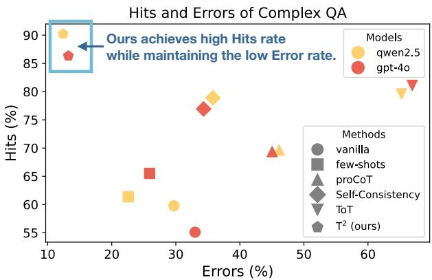

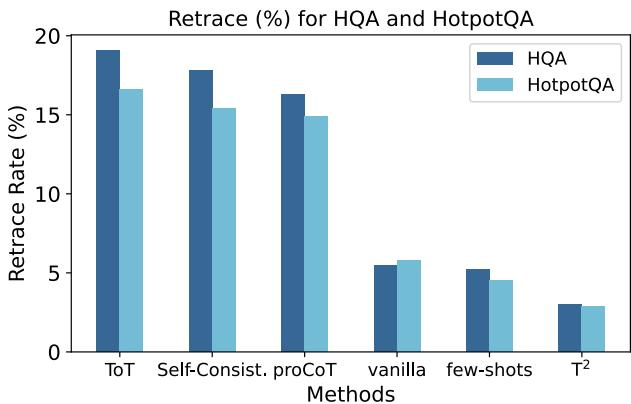  
Figure 2: Results on Hits and Errors (left) and Retrace Rate (right).

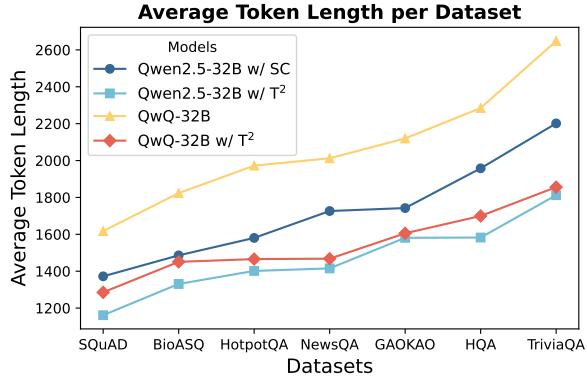  
Figure 3: Results of average token length on each dataset. SC is the abbreviation for Self-Consistency.

## 4.3 Similar Examples Quality Analysis

Our Matching Strategy Can Expose More Diverse Reasoning Skills. The effectiveness of our framework relies not only on identifying appropriate reasoning skills but also on how these skills are matched during the example selection. Hence, we examine the impact of our multi-criteria reasoning skills matching strategy compared to a naive uniform sampling approach. Table 3 presents the results of our experiment against uniform sampling across different reasoning skill types. Our approach consistently outperforms uniform sampling across all skill categories, with particularly notable improvements for less frequent reasoning types such as decompositional reasoning (+8.3%) and analogical reasoning (+7.7%). This confirms our hypothesis that the strategic balancing of skill demonstrations enhances the model’s ability to leverage diverse reasoning patterns. The distribution of each reasoning skill can be found in Appendix C. Ablation study of multi-criteria matching strategy can be found in Appendix H.

Accuracy of Reasoning Skills Results in Correctness of Answers. We examined the correlation between the accuracy of selected reasoning skills and the correctness of final answers using the HotpotQA dataset. We conducted the experiment on two models: Qwen2.5-32B-Instruct w/ $\mathrm { T ^ { 2 } }$ and QwQ-32B-Preview w/ $\mathrm { T ^ { 2 } }$ . The analysis, shown in Figure 5, reveals a strong positive correlation between skill accuracy and answer correctness. Higher skill accuracy corresponds to higher answer correctness, with an approximate 5-6% increase in correctness for every 5% improvement in skill accuracy. These results demonstrate that accurately selecting the correct reasoning skills is essential for generating correct answers, especially in complex multi-hop reasoning tasks.

We also discuss the impacts of question structure (J.1), impacts of numbers of similar examples (J.3), impacts of various generated methods (J.4), impacts of threshold of similarity in generation (J.5), impacts of examples domain bias and structural bias (J.6), and human evaluation (J.7) in Appendix.

## 4.4 Case Study

Figure 4 shows an short version of example to show effectiveness of our $\mathrm { T ^ { 2 } }$ . By explicitly providing the model-specific reasoning path, the model can generate the correct answer with an appropriate reasoning chain of thought. The detailed case studies can be found in Appendix K.

<table><tr><td>[Reference Documents] Question: In what city was the subject of the film Nowhere Boy born?</td><td>Quick Thinking Model&#x27;s Wrong Answer: The subject of Nowhere Boy was born in London.</td></tr><tr><td>Proper Reasoning Chain:</td><td>Slow Thinking Model&#x27;s Overthinking Answer: [After a lengthy analysis of various biographical details concerning]</td></tr><tr><td>1. Decompositional: Find the (a) film subject, (b) born place 2. Deductive: Nowhere Boy is about John</td><td>John Lennon .. was born in Liverpool.</td></tr><tr><td>Lennon 3. Deductive: John was born in Liverpool</td><td>Model with our FReM&#x27;s Correct Answer: Since Nowhere Boy is a film about John Lennon (Doc 2) and Doc 1 confirms that John was born in Liverpool. We deduce the answer is</td></tr></table>

Figure 4: Case study to show effectiveness of our $\mathrm { T ^ { 2 } }$ framework. There are three proper reasoning skills should be adopted to answer the question based on given documents. The red, orange, and green answers represent responses under quick thinking, slow thinking, and ours, respectively.

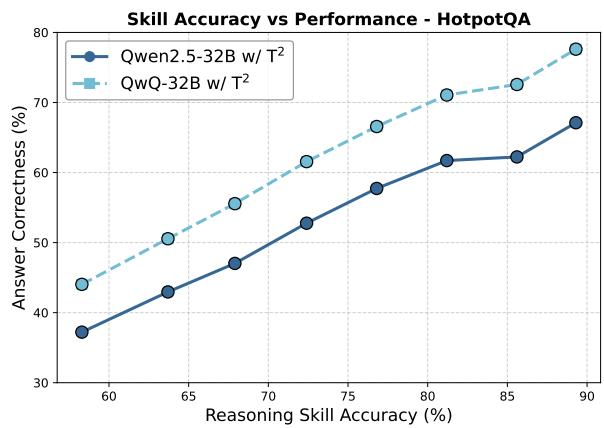  
Figure 5: Results on relationship between reasoning skills’ accuracy and overall performance.

## 5 Conclusion

In this paper, we introduced $\mathrm { T ^ { 2 } } { \mathrm { ; } }$ Think-to-Think, a novel framework that dynamically adapts reasoning depth based on question complexity for contextual question answering tasks. Unlike prior approaches that employ fixed reasoning strategies regardless of question difficulty, $\mathrm { T ^ { 2 } }$ enables models to learn appropriate reasoning strategies from similar examples, leading to more efficient processing while maintaining accuracy. Our experimental results across seven diverse CQA benchmarks confirm that $\mathrm { T ^ { 2 } }$ not only achieves higher accuracy than baseline methods but also reduces computational overhead by up to 25.2%. These improvements demonstrate the value of adaptability in reasoning processes, suggesting that as language models continue to evolve, approaches like $\mathrm { T ^ { 2 } }$ that optimize both accuracy and computational efficiency will become increasingly important for developing more intelligent systems that can effectively allocate computational resources based on task demands.

## Limitations

While $\mathrm { T ^ { 2 } } { \mathrm { ; } }$ : Think-to-Think demonstrates promising results across various CQA benchmarks, we acknowledge several limitations of our approach: First, the effectiveness of $\mathrm { T ^ { 2 } }$ relies on the availability of high-quality example reasoning strategy for similarity matching. In domains with limited annotated examples or highly novel questions, the framework may struggle to identify appropriate reasoning patterns, potentially defaulting to less optimal strategies. Besides, our current implementation focuses primarily on textual reasoning tasks. Extending $\mathrm { T ^ { 2 } }$ to multimodal reasoning contexts (e.g., visual question answering) would require additional architectural modifications to handle diverse input modalities while maintaining computational efficiency. Despite these limitations, we believe $\mathrm { T ^ { 2 } }$ represents a significant step toward more adaptive and efficient reasoning systems that can intelligently allocate computational resources based on question complexity.

## Ethical Considerations

We ensure that all experiments are conducted using publicly available, ethically sourced datasets, adhering to privacy and intellectual property guidelines. We acknowledge the potential for biases in data and are committed to evaluating and mitigating any such biases in $\mathrm { T ^ { 2 } }$

## Acknowledgements

We thank the reviewers, the AC, and the SAC for their constructive comments. This work is partially supported by Hong Kong RGC GRF No.14206324, CUHK Knowledge Transfer Project Fund No.KPF23GWP20, and Research Funds for NSD Construction, University of International Relations (Grant numbers: 2024GA07). We’d also like to thank Ms. Ziya Zhou for her feedback on refining our figure.

## References

Anthropic. 2025. Claude 3.7 sonnet system card. Technical report.

Paul Bartha. 2013. Analogy and Analogical Reasoning. In Edward N. Zalta and Uri Nodelman, editors, The Stanford Encyclopedia of Philosophy, Fall 2024 edition. Metaphysics Research Lab, Stanford University.

Pedro Bordalo, Nicola Gennaioli, Giacomo Lanzani, and Andrei Shleifer. 2024. A cognitive theory of reasoning and choice.

Bradley Brown, Jordan Juravsky, Ryan Ehrlich, Ronald Clark, Quoc V Le, Christopher Ré, and Azalia Mirhoseini. 2024. Large language monkeys: Scaling inference compute with repeated sampling. arXiv preprint arXiv:2407.21787.

Lingjiao Chen, Jared Quincy Davis, Boris Hanin, Peter Bailis, Ion Stoica, Matei A Zaharia, and James Y Zou. 2024. Are more llm calls all you need? towards the scaling properties of compound ai systems. Advances in Neural Information Processing Systems, 37:45767– 45790.

Yang Deng, Lizi Liao, Liang Chen, Hongru Wang, Wenqiang Lei, and Tat-Seng Chua. 2023. Prompting and evaluating large language models for proactive dialogues: Clarification, target-guided, and noncollaboration. In Findings of the Association for Computational Linguistics: EMNLP 2023, pages 10602–10621, Singapore. Association for Computational Linguistics.

Google Gemini. 2025a. Gemini 2.5 flash thinking mode.

Google Gemini. 2025b. Gemini 2.5: Our most intelligent ai model. Technical report.

Daya Guo, Dejian Yang, Haowei Zhang, Junxiao Song, Ruoyu Zhang, Runxin Xu, Qihao Zhu, Shirong Ma, Peiyi Wang, Xiao Bi, and 1 others. 2025. Deepseek-r1: Incentivizing reasoning capability in llms via reinforcement learning. arXiv preprint arXiv:2501.12948.

Sabbir Hosen, Jannatul Ferdous Eva, Ayman Hasib, Aloke Kumar Saha, M.F. Mridha, and Anwar Hussen Wadud. 2023. Hqa-data: A historical question answer generation dataset from previous multi perspective conversation. Data in Brief, 48:109245.

Zhen Huang, Haoyang Zou, Xuefeng Li, Yixiu Liu, Yuxiang Zheng, Ethan Chern, Shijie Xia, Yiwei Qin, Weizhe Yuan, and Pengfei Liu. 2024. O1 replication journey–part 2: Surpassing o1-preview through simple distillation, big progress or bitter lesson? arXiv preprint arXiv:2411.16489.

Aaron Hurst, Adam Lerer, Adam P Goucher, Adam Perelman, Aditya Ramesh, Aidan Clark, AJ Ostrow, Akila Welihinda, Alan Hayes, Alec Radford, and 1 others. 2024. Gpt-4o system card. arXiv preprint arXiv:2410.21276.

Aaron Jaech, Adam Kalai, Adam Lerer, Adam Richardson, Ahmed El-Kishky, Aiden Low, Alec Helyar, Aleksander Madry, Alex Beutel, Alex Carney, and 1 others. 2024. Openai o1 system card. arXiv preprint arXiv:2412.16720.

Ke Ji, Jiahao Xu, Tian Liang, Qiuzhi Liu, Zhiwei He, Xingyu Chen, Xiaoyuan Liu, Zhijie Wang, Junying Chen, Benyou Wang, and 1 others. 2025. The first few tokens are all you need: An efficient and effective unsupervised prefix fine-tuning method for reasoning models. arXiv preprint arXiv:2503.02875.

Zhengbao Jiang, Frank F. Xu, Luyu Gao, Zhiqing Sun, Qian Liu, Jane Dwivedi-Yu, Yiming Yang, Jamie Callan, and Graham Neubig. 2023. Active retrieval augmented generation. In Proceedings ofthe 2023 Conference on Empirical Methods in Natural Language Processing, EMNLP 2023, Singapore, December 6-10, 2023, pages 7969–7992. Association for Computational Linguistics.

Mandar Joshi, Eunsol Choi, Daniel Weld, and Luke Zettlemoyer. 2017. TriviaQA: A large scale distantly supervised challenge dataset for reading comprehension. In Proceedings of the 55th Annual Meeting of the Association for Computational Linguistics (Volume 1: Long Papers), pages 1601–1611, Vancouver, Canada. Association for Computational Linguistics.

Uri Katz, Matan Vetzler, Amir Cohen, and Yoav Goldberg. 2023. Neretrieve: Dataset for next generation named entity recognition and retrieval. In Findings of the Association for Computational Linguistics: EMNLP 2023, pages 3340–3354.

Omar Khattab, Keshav Santhanam, Xiang Lisa Li, David Hall, Percy Liang, Christopher Potts, and Matei Zaharia. 2022. Demonstrate-search-predict: Composing retrieval and language models for knowledge-intensive NLP. CoRR, abs/2212.14024.

Yifei Li, Zeqi Lin, Shizhuo Zhang, Qiang Fu, Bei Chen, Jian-Guang Lou, and Weizhu Chen. 2023. Making language models better reasoners with step-aware verifier. In Proceedings of the 61st Annual Meeting ofthe Associationfor Computational Linguistics (Volume 1: Long Papers), pages 5315–5333.

Hunter Lightman, Vineet Kosaraju, Yuri Burda, Harrison Edwards, Bowen Baker, Teddy Lee, Jan Leike, John Schulman, Ilya Sutskever, and Karl Cobbe. 2023. Let’s verify step by step. In The Twelfth International Conference on Learning Representations.

Xinbei Ma, Yeyun Gong, Pengcheng He, Hai Zhao, and Nan Duan. 2023. Query rewriting for retrieval-augmented large language models. CoRR, abs/2305.14283.

Yingqian Min, Zhipeng Chen, Jinhao Jiang, Jie Chen, Jia Deng, Yiwen Hu, Yiru Tang, Jiapeng Wang, Xiaoxue Cheng, Huatong Song, and 1 others. 2024. Imitate, explore, and self-improve: A reproduction report on slow-thinking reasoning systems. arXiv preprint arXiv:2412.09413.

Niklas Muennighoff, Zitong Yang, Weijia Shi, Xiang Lisa Li, Li Fei-Fei, Hannaneh Hajishirzi, Luke Zettlemoyer, Percy Liang, Emmanuel Candès, and Tatsunori Hashimoto. 2025. s1: Simple test-time scaling. arXiv preprint arXiv:2501.19393.

Ofir Press, Muru Zhang, Sewon Min, Ludwig Schmidt, Noah A. Smith, and Mike Lewis. 2023. Measuring and narrowing the compositionality gap in language models. In Findings of the Association for Computational Linguistics: EMNLP 2023, Singapore, December 6-10, 2023, pages 5687–5711. Association for Computational Linguistics.

Qwen. 2024. Qwq: Reflect deeply on the boundaries of the unknown.

Qwen. 2025. Qwq-32b: Embracing the power of reinforcement learning. Technical report.

Pranav Rajpurkar, Robin Jia, and Percy Liang. 2018. Know what you don’t know: Unanswerable questions for SQuAD. In Proceedings of the 56th Annual Meeting of the Association for Computational Linguistics (Volume 2: Short Papers), pages 784–789, Melbourne, Australia. Association for Computational Linguistics.

Zhihong Shao, Yeyun Gong, Yelong Shen, Minlie Huang, Nan Duan, and Weizhu Chen. 2023. Enhancing retrieval-augmented large language models with iterative retrieval-generation synergy. In Findings of the Association for Computational Linguistics: EMNLP 2023, Singapore, December 6-10, 2023, pages 9248–9274. Association for Computational Linguistics.

Yi Shen, Jian Zhang, Jieyun Huang, Shuming Shi, Wenjing Zhang, Jiangze Yan, Ning Wang, Kai Wang, and Shiguo Lian. 2025. Dast: Difficulty-adaptive slowthinking for large reasoning models. arXiv preprint arXiv:2503.04472.

Adam Trischler, Tong Wang, Xingdi Yuan, Justin Harris, Alessandro Sordoni, Philip Bachman, and Kaheer Suleman. 2017. Newsqa: A machine comprehension dataset. In Proceedings of the 2nd Workshop on Representation Learningfor NLP, pages 191–200.

Harsh Trivedi, Niranjan Balasubramanian, Tushar Khot, and Ashish Sabharwal. 2023. Interleaving retrieval with chain-of-thought reasoning for knowledgeintensive multi-step questions. In Proceedings of the 61st Annual Meeting of the Association for Computational Linguistics (Volume 1: Long Papers), ACL 2023, Toronto, Canada, July 9-14, 2023, pages 10014–10037. Association for Computational Linguistics.

George Tsatsaronis, Georgios Balikas, Prodromos Malakasiotis, Ioannis Partalas, Matthias Zschunke, Michael R Alvers, Dirk Weissenborn, Anastasia Krithara, Sergios Petridis, Dimitris Polychronopoulos, Yannis Almirantis, John Pavlopoulos, Nicolas Baskiotis, Patrick Gallinari, Thierry Artieres, Axel Ngonga, Norman Heino, Eric Gaussier, Liliana Barrio-Alvers, and 3 others. 2015. An overview of the bioasq large-scale biomedical semantic indexing and question answering competition. BMC Bioinformatics, 16:138.

Xuezhi Wang, Jason Wei, Dale Schuurmans, Quoc Le, Ed Chi, Sharan Narang, Aakanksha Chowdhery, and Denny Zhou. 2022. Self-consistency improves chain of thought reasoning in language models. arXiv preprint arXiv:2203.11171.

Jason Wei, Xuezhi Wang, Dale Schuurmans, Maarten Bosma, Fei Xia, Ed Chi, Quoc V Le, Denny Zhou, and 1 others. 2022. Chain-of-thought prompting elicits reasoning in large language models. Advances in neural information processing systems, 35:24824– 24837.

Yangzhen Wu, Zhiqing Sun, Shanda Li, Sean Welleck, and Yiming Yang. 2024. An empirical analysis of compute-optimal inference for problem-solving with language models.

Mayi Xu, Yongqi Li, Ke Sun, and Tieyun Qian. 2024. Adaption-of-thought: Learning question difficulty improves large language models for reasoning. In Proceedings of the 2024 Conference on Empirical Methods in Natural Language Processing, pages 5468–5495.

An Yang, Baosong Yang, Beichen Zhang, Binyuan Hui, Bo Zheng, Bowen Yu, Chengyuan Li, Dayiheng Liu, Fei Huang, Haoran Wei, Huan Lin, Jian Yang, Jianhong Tu, Jianwei Zhang, Jianxin Yang, Jiaxi Yang, Jingren Zhou, Junyang Lin, Kai Dang, and 22 others. 2024. Qwen2.5 technical report. Technical report.

Wenkai Yang, Shuming Ma, Yankai Lin, and Furu Wei. 2025. Towards thinking-optimal scaling of test-time compute for llm reasoning. arXiv preprint arXiv:2502.18080.

Zhilin Yang, Peng Qi, Saizheng Zhang, Yoshua Bengio, William W. Cohen, Ruslan Salakhutdinov, and Christopher D. Manning. 2018. HotpotQA: A dataset for diverse, explainable multi-hop question answering. In Conference on Empirical Methods in Natural Language Processing (EMNLP).

Shunyu Yao, Dian Yu, Jeffrey Zhao, Izhak Shafran, Tom Griffiths, Yuan Cao, and Karthik Narasimhan. 2023. Tree of thoughts: Deliberate problem solving with large language models. Advances in neural information processing systems, 36:11809–11822.

Zheng Yuan, Hongyi Yuan, Chengpeng Li, Guanting Dong, Keming Lu, Chuanqi Tan, Chang Zhou, and Jingren Zhou. 2023. Scaling relationship on learning mathematical reasoning with large language models. arXiv preprint arXiv:2308.01825.

Zhiyuan Zeng, Qinyuan Cheng, Zhangyue Yin, Yunhua Zhou, and Xipeng Qiu. 2025. Revisiting the test-time scaling of o1-like models: Do they truly possess test-time scaling capabilities? arXiv preprint arXiv:2502.12215.

Di Zhang, Xiaoshui Huang, Dongzhan Zhou, Yuqiang Li, and Wanli Ouyang. 2024a. Accessing gpt-4 level mathematical olympiad solutions via monte carlo tree self-refine with llama-3 8b. arXiv preprint arXiv:2406.07394.

Xiaotian Zhang, Chunyang Li, Yi Zong, Zhengyu Ying, Liang He, and Xipeng Qiu. 2024b. Evaluating the performance of large language models on gaokao benchmark. Preprint, arXiv:2305.12474.

Yu Zhao, Huifeng Yin, Bo Zeng, Hao Wang, Tianqi Shi, Chenyang Lyu, Longyue Wang, Weihua Luo, and Kaifu Zhang. 2024. Marco-o1: Towards open reasoning models for open-ended solutions. arXiv preprint arXiv:2411.14405.

## A Full Reasoning Skills

Defined by (Bartha, 2013; Bordalo et al., 2024), reasoning can best be defined as the basic action of thinking in a sensible and rational way about something. Reasoning is the ability to assess things rationally by applying logic based on new or existing information when making a decision or solving a problem. Based on their conclusion, Tables 5 and 6 show the reasoning skills for answering a certain question.

## A.1 Extended Explanation of Sub-Questions and Reasoning Skills

Subquestions serve as atomic reasoning operations that systematically decompose complex questions into manageable components. Each subquestion corresponds to a specific cognitive task that must be completed to progress toward answering the original question. This decomposition allows the model to focus on discrete information pieces sequentially while applying appropriate reasoning skills at each step. Consider the question: “Which is taller, the Eiffel Tower or the Empire State Building?” Table 4 shows the decomposition process. This structured approach reduces cognitive load by isolating individual reasoning steps and creates explicit intermediate reasoning states that can be verified independently.

## B Datasets

In this work, we evaluate our method on seven widely used question answering datasets. Each dataset presents distinct characteristics, ranging from the type of questions asked to the domain in which they are applied. Below, we provide a brief overview of each dataset.

SQuAD consists of over 100,000 questionanswer pairs derived from a set of Wikipedia articles. The task is to find the span of text that answers the question. SQuAD is widely used for evaluating machine reading comprehension models. The dataset includes two versions: SQuAD 1.1, which contains answerable questions, and SQuAD 2.0, which also includes unanswerable questions, making it more challenging. We use 2.0 version here.

HotpotQA is a large-scale, multi-hop question answering dataset that requires reasoning across multiple supporting facts. The dataset includes over 113,000 question-answer pairs spanning various domains, where answers cannot be found in a single sentence or passage but require combining information from several documents. The questions in HotpotQA require a more complex reasoning process compared to typical single-hop datasets.

BioASQ is a biomedical question answering dataset that provides information from scientific articles, primarily in the domain of biomedicine. It includes both factoid and complex questions that require understanding of scientific literature. BioASQ focuses on answering clinical, biomedical, and molecular biology-related questions using both structured and unstructured data sources.

NewsQA is a dataset designed for reading comprehension tasks. It consists of over 100,000 question-answer pairs derived from news articles. The challenge of NewsQA lies in answering questions about real-world events from unstructured news stories, requiring models to handle various linguistic phenomena such as coreference, reasoning, and implicit understanding.

GAOKAO is a dataset derived from the Chinese college entrance exam, also known as the "Gaokao". It contains questions related to various subjects, including Chinese literature, mathematics, and English. The questions in GAOKAO require both general knowledge and reasoning to answer. This dataset is specifically designed for the Chinese education system and is widely used in academic and educational research in China.

HQA is a human-annotated dataset specifically designed for complex, open-domain question answering. It contains questions that require deep contextual understanding and can involve reasoning across long documents. The dataset includes various types of questions and answers across diverse domains, and it was created to test models ability to perform reasoning tasks in realistic, openended settings.

<table><tr><td>Subquestion</td><td>Reasoning Skill</td><td>Purpose</td></tr><tr><td>&quot;What is the height of the Eiffel Tower?&quot;</td><td>Deductive</td><td>Establishes first measurement</td></tr><tr><td>&quot;What is the height of the Empire State Building?&quot;</td><td>Deductive</td><td>Establishes second measurement</td></tr><tr><td>&quot;Which height value is greater?&quot;</td><td>Cause and Effect</td><td>Determines the final answer</td></tr></table>

Table 4: Example of question decomposition with associated reasoning skills
<table><tr><td>Type of Reasoning</td><td>Detailed Description</td><td>Example</td></tr><tr><td>Deductive</td><td>Deductive reasoning occurs when generalized state- ments apply to specific cases. These generalized statements are established and already proven, mak- ing specific cases easy to deduce. For example, all humans are mortals. Bill is a human, so Bill must be mortal. In this example the generalized, but proven, statement, “all humans are mortals&quot; is what drives</td><td>Document: All shapes with three sides are triangles. A certain figure here has exactly three sides. Question: What is this figure called? Answer: It is a triangle. All shapes with three sides are triangles, and this figure has three sides. So it must be a triangle.</td></tr><tr><td>Inductive</td><td>the reasoning. Inductive reasoning is similar to deductive reason- ing in that they both draw a conclusion based on a statement. However, in inductive reasoning, the statement is likely but has not been proven. For example, roses usually bloom in spring. In spring, one can count on there being roses. Again, the dif- ference is that this is likely but not proven to be 100%.</td><td>Document: Every spring for the past ten years, wild roses in Green Valley have bloomed in late March. This spring is about to begin in Green Valley. Question: Will the wild roses bloom in late March this year? Answer: It is likely they will bloom in late March, because they usually do, but it is not guaranteed.</td></tr><tr><td>Abductive</td><td>Abductive reasoning is the act of making a conclu- sion based on what you already know. For example, if you see a plate of food still hot, but half-eaten, you can make the conclusion that the person eating that food is probably returning soon.</td><td>Document: You notice a half-eaten sandwich and a still-hot cup of coffee on a café table The seat feels warm, and a jacket is draped over the chair. Question: Has the person who was sitting here left permanently, or are they coming back soon? Answer: It is likely they just stepped away for a moment and will return, because the food and drink are still warm and their jacket</td></tr><tr><td>Cause &amp; Effect</td><td>Cause and effect reasoning is that if x happens then y will happen as a result. This is extremely persua- sive when making a speech or trying to get some- one to take action to cause an effect. For example, a politician may say that if they are elected, then poverty will decrease. This is using cause and effect reasoning in a real-world situation.</td><td>remains on the chair. Document: Meteorologists predict heavy rain this evening, with warnings that streets may flood if the rainfall continues. Question: Will the roads become dangerous as a result of this weather? Answer: Yes. If heavy rain continues, roads will likely flood and become slippery, causing drivers to have less control of their vehicles.</td></tr></table>

Table 5: (1/2) Full list of reasoning skills used in the reasoning path construction.

TriviaQA is a large-scale dataset that focuses on answering trivia questions, where each question is associated with a corresponding set of supporting documents. TriviaQA contains over 650,000 question-answer pairs sourced from trivia websites and requires models to retrieve relevant information from the documents and answer based on the provided facts. The dataset has questions spanning various topics such as history, geography, and general knowledge.

## B.1 Application Scope and Limitations

Our research specifically focuses on Contextual Question Answering (CQA) tasks, which represent a distinct reasoning paradigm from other complex reasoning domains (like math or code). The proposed approach is designed to address efficiency challenges in general CQA tasks, where models often generate unnecessarily verbose reasoning for simple questions—particularly relevant for practical applications with constrained computational resources. We acknowledge that our method may not be directly applicable to highly structured reasoning domains such as mathematics, programming, and algorithmic reasoning, where approaches like Tree of Thought (ToT) and Monte Carlo Tree Search (MCTS) have demonstrated strong performance. This limitation stems from the fundamental differences between CQA tasks (which involve flexible reasoning patterns in natural language) and formal domains (which follow well-defined rules with constrained, sequential reasoning paths). Additionally, creating similar example questions for these structured domains presents significant challenges, as their solution spaces typically benefit from systematic exploration techniques rather than our adaptive reasoning approach.

<table><tr><td>Type of Reasoning</td><td>Detailed Description</td><td>Example</td></tr><tr><td>Analogical</td><td>Analogical reasoning is the use of a comparison between two things to persuade that there must be more in common if they already share something. For example, if x, y, and z all share this trait, then they must also share other traits. The foundation of this type of reasoning is perfect for speeches and comparisons in the real world. If there are connections between x and y already, then they must have several other things in common as well.</td><td>Document: Many leading technology com- panies emphasize continuous learning and adaptability. For instance, Google, Microsoft, and Amazon all invest in regular training pro- grams and encourage innovation among em- ployees. Their similar approach to fostering a culture of growth has been linked to their strong performance in rapidly changing mar kets. Question: Can we infer that a company that promotes continuous learning will also likely be successful in adapting to market changes? Answer: Yes. Since Google, Microsoft, and Amazon all share a culture of continuous learning and, as a result, demonstrate high adaptability and market success, it is reason- able to conclude by analogy that a company which also promotes continuous learning is likely to develop similar strengths.</td></tr><tr><td>Critical Thinking</td><td>Critical thinking occurs when you take all of the facts and develop a conclusion based on an analysis. This could happen subconsciously or intentionally, depending on the situation. For example, in the real world, critical thinking could be about your rela- tionships. You could see a behavior you don&#x27;t like about someone and have to think critically about whether or not you will choose to spend more time with this person. This is using critical thinking to develop reasoning in a real-world application.</td><td>Document: Over the past few months, Sam has repeatedly cancelled plans at the last minute and rarely communicated afterward. Question: Should you invest time in a close friendship with Sam? Answer: No. Sam&#x27;s consistent behavior of last-minute cancellations suggests a pattern of unreliability, which may negatively affect the trust needed in a close friendship.</td></tr><tr><td>Decompositional</td><td>Decompositional reasoning happens when the dif- ferent parts of the reasoning are broken down into smaller pieces and analyzed for how they contribute to the whole. The intent of this is to make the rea- soning easier to understand and allow for analyzing how the parts equal the whole. For example, in order to understand the function of the human body, you would have to analyze each bone and organ to see how they all work together. Additionally, in the real world, an argument could be broken down into several smaller parts in order to analyze the effectiveness of the argument as a whole.</td><td>Document: A smartphone&#x27;s quality can be un- derstood by breaking it down into three parts: its design, performance, and battery life. The design covers the build and user interface; performance looks at processing speed and software efficiency; battery life shows how long the device operates on a single charge. Question: Can we conclude that the smart- phone provides a good overall user experi- ence? Answer: Yes. If the design is appealing, the performance is robust, and the battery life is long, then the smartphone is likely to offer a good overall experience.</td></tr></table>

Table 6: (2/2) Full list of reasoning skills used in the reasoning path construction.

## C Distribution of Reasoning Skills in Each Dataset

Table 7 demonstrates the distribution of seven reasoning skills in different datasets. The variance in skill distribution highlights why our multi-criteria matching approach is crucial. Without it, highfrequency skills like deductive reasoning would dominate the demonstrations, while valuable but less common skills like abductive reasoning would be underrepresented.

## D Implementations

## D.1 For PLM Usage

We use a simple pretrained language model RoBERTa from Huggingface for detecting named entities or key numbers in the question to obtain the question structure. This classification task involves processing the input question to identify whether it contains a named entity or key number and assigning a type to the detected entity. The model performs this task by outputting binary labels (entity: Yes/No) first, and then the associated entity types (e.g., Person, Location, Date, Organization, Number, etc.).

This model is fine-tuned with a simple classification layer that detects whether a named entity or key number is present in the question with NERetrieve dataset3 (Katz et al., 2023). This process leverages the model’s pre-trained knowledge, with minimal fine-tuning specifically focused on the entity detection and classification task.

The hyperparameters used for fine-tuning the PLM are listed in Table 8. The batch size is set to 128. The learning rate is set to $2 \times 1 0 ^ { - 5 }$ . AdamW is used as the optimizer. A dropout rate of 0.1 is applied to prevent overfitting during fine-tuning.

## D.2 Why Choose PLM?

While modern LLMs can generate similar question decompositions in a zero-shot manner, our fine-tuned encoder approach offers several advantages. The computational cost of our fine-tuned RoBERTa model is negligible compared to prompting an LLM (approximately 0.1% of inference time), making it highly efficient for decomposition tasks. Additionally, the fine-tuned encoder ensures consistent identification of structural elements, which is crucial for generating diverse yet structurally similar questions.

To validate our approach, we conducted additional experiments comparing: (1) our finetuned RoBERTa-based approach, (2) off-the-shelf NER models (RoBERTa), and (3) zero-shot LLM prompting for question decomposition. Table 9 presents the impact of different decomposition methods on the final performance across datasets.

We also conducted both automatic and human evaluations of the decomposition quality. For automatic evaluation, we used GPT-4 to assess the structural accuracy, element boundary precision, and template usability of decompositions generated by each method on a scale of 1-5. For human evaluation, we measured exact match, relaxed match, and structural correctness. Tables 10 and 25 present these results.

In our experiments, we used Qwen3-0.6B (600M parameters) as our zero-shot LLM, which is comparable in size to our fine-tuned RoBERTa model (approximately 400M parameters). This allows for a fair comparison where performance differences can be attributed to the approach rather than simply model scale advantages.

These results demonstrate that while all methods produce comparable final performance, our finetuned approach provides superior boundary detection for template elements (4.82 vs. 4.27 GPT-4 rating), higher exact match scores in human evaluation (87.6% vs. 78.9%), and minimal computational overhead while maintaining consistency.

## D.3 For LLM Usage

For LLM usage, We use two quick-thinking LLMs (Qwen2.5-32B-Instract (Yang et al., 2024), and GPT-4o (Hurst et al., 2024; Guo et al., 2025)) and several slow-thinking LLMs (GPTo1/3/4 series (Jaech et al., 2024), QwQ-32B-Preview (Qwen, 2025), Claude-3.7 (Anthropic, 2025), Gemini-2.5-Pro (Gemini, 2025b)). For ToT implementation, we follow the original paper’s approach (Yao et al., 2023) with a breadthfirst search strategy and a maximum depth of 3. For MCTS, we implement the standard UCT algorithm with 10 simulations per decision point. For synthetic QA generation, we set a maximum output length of 4,096 tokens. When deciding which similar example to use, we follow our multi-criteria matching (Section 3.3) to pick the most relevant chain of skills. Unless otherwise specified, hyperparameters stay at default values for each model. No domain-specific fine-tuning and no targeted designed prompt are applied, ensuring a fair and consistent comparison. All inferences are based on vLLM framework.

<table><tr><td>Skill Type</td><td>SQuAD</td><td>HotpotQA</td><td>NewsQA</td><td>GAOKAO</td><td>HQA</td><td>TriviaQA</td><td>BioASQ</td></tr><tr><td>Deductive</td><td>0.31</td><td>0.22</td><td>0.28</td><td>0.15</td><td>0.42</td><td>0.18</td><td>0.25</td></tr><tr><td>Inductive</td><td>0.23</td><td>0.18</td><td>0.15</td><td>0.12</td><td>0.13</td><td>0.21</td><td>0.19</td></tr><tr><td>Abductive</td><td>0.05</td><td>0.12</td><td>0.08</td><td>0.21</td><td>0.09</td><td>0.15</td><td>0.11</td></tr><tr><td>Cause &amp; Effect</td><td>0.12</td><td>0.15</td><td>0.13</td><td>0.22</td><td>0.08</td><td>0.19</td><td>0.14</td></tr><tr><td>Analogical</td><td>0.08</td><td>0.13</td><td>0.09</td><td>0.07</td><td>0.11</td><td>0.12</td><td>0.16</td></tr><tr><td>Critical Thinking</td><td>0.14</td><td>0.16</td><td>0.18</td><td>0.14</td><td>0.13</td><td>0.09</td><td>0.10</td></tr><tr><td>Decompositional</td><td>0.07</td><td>0.04</td><td>0.09</td><td>0.09</td><td>0.04</td><td>0.06</td><td>0.05</td></tr></table>

Table 7: Distribution (%) of reasoning skills across benchmark datasets, showing the proportion of questions requiring each skill type.
<table><tr><td>Parameter</td><td>Value</td></tr><tr><td>Model</td><td>RoBERTa</td></tr><tr><td>Full Name</td><td>FacebookAI/xlm-roberta-large-finetuned-conll03-english</td></tr><tr><td>Batch Size</td><td>128</td></tr><tr><td>Learning Rate</td><td>2e-5</td></tr><tr><td>Optimizer</td><td>AdamW</td></tr><tr><td>Dropout Rate</td><td>0.1</td></tr><tr><td>Evaluation Metric</td><td>Accuracy</td></tr></table>

Table 8: Implementation parameters for named entity detection and classification.

<table><tr><td>Decomposition Method</td><td>SQuAD</td><td>HotpotQA</td><td>NewsQA</td><td>Gaokao</td><td>HQA</td><td>TriviaQA</td><td>BioASQ</td></tr><tr><td>Fine-tuned RoBERTa (Ours)</td><td>85.06</td><td>66.16</td><td>60.92</td><td>37.57</td><td>45.27</td><td>53.92</td><td>66.97</td></tr><tr><td>RoBERTa</td><td>84.89</td><td>65.87</td><td>60.63</td><td>37.21</td><td>44.98</td><td>53.77</td><td>66.58</td></tr><tr><td>Zero-shot LLM prompting</td><td>84.72</td><td>65.69</td><td>60.41</td><td>37.06</td><td>44.83</td><td>53.61</td><td>66.42</td></tr></table>

Table 9: Impact of question decomposition method on final performance across datasets.

<table><tr><td>Decomposition Method</td><td>Structural Accuracy</td><td>Element Boundary Precision</td><td>Template Usability</td></tr><tr><td>Fine-tuned RoBERTa (Ours)</td><td>4.78</td><td>4.82</td><td>4.71</td></tr><tr><td>RoBERTa</td><td>4.63</td><td>4.41</td><td>4.52</td></tr><tr><td>Zero-shot LLM prompting</td><td>4.56</td><td>4.27</td><td>4.38</td></tr></table>

Table 10: GPT-4 evaluation of decomposition quality (scale 1-5).
<table><tr><td>Decomposition Method</td><td>Exact Match</td><td>Relaxed Match</td><td>Structural Correctness</td></tr><tr><td>Fine-tuned RoBERTa (Ours)</td><td>87.6%</td><td>94.3%</td><td>96.2%</td></tr><tr><td>RoBERTa</td><td>81.4%</td><td>93.2%</td><td>95.7%</td></tr><tr><td>Zero-shot LLM prompting</td><td>78.9%</td><td>92.8%</td><td>94.9%</td></tr></table>

Table 11: Human evaluation of decomposition quality.

## E Inference Prompts

The primary task is to generate synthetic questionanswer pairs with a reasoning path, reflecting predefined reasoning skills. Table 12 shows our prompts.

Table 13 shows the helper language model for

evaluating how well each example’s question aligns with original one.

Table 14 shows the question answering prompts for model.

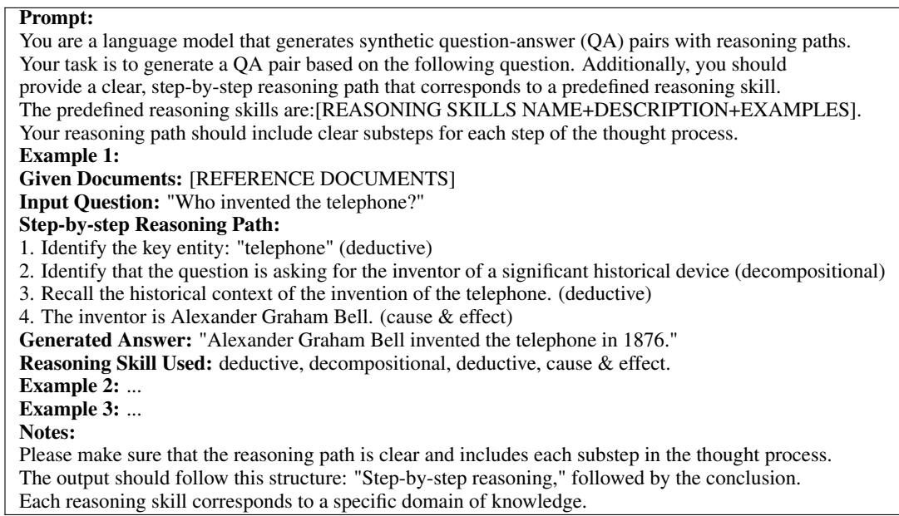

Table 12: Prompt to Generate Similar Examples with Reasoning Paths.  
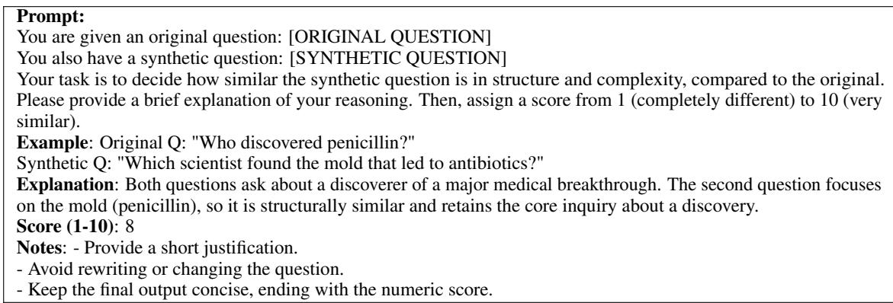  
Table 13: Prompt for Evaluating Alignment of Synthetic Questions with the Original.

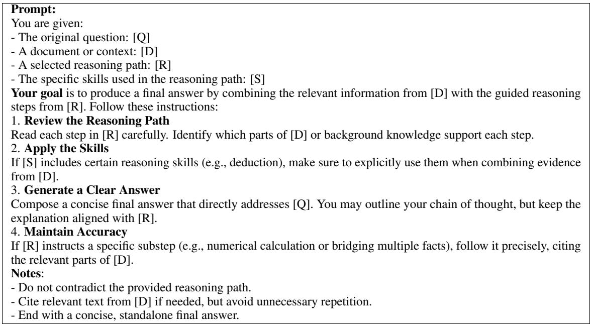  
Table 14: Prompt for Question Answering.

<table><tr><td>Model</td><td>SQuAD</td><td>HotpotQA</td><td>NewsQA</td><td>Gaokao</td><td>HQA</td><td>TriviaQA</td><td>BioASQ</td></tr><tr><td colspan="8">Quick-Thinking Models w/ Reasoning Strategies (Exact Match)</td></tr><tr><td colspan="8">Qwen2.5-32B-Instruct</td></tr><tr><td>w/ vanilla (quick)</td><td>55.23</td><td>31.69</td><td>27.15</td><td>12.61</td><td>19.47</td><td>23.82</td><td>40.88</td></tr><tr><td>w/ few-shots (quick)</td><td>56.42</td><td>32.35</td><td>28.13</td><td>13.06</td><td>20.19</td><td>24.58</td><td>41.76</td></tr><tr><td>w/ self-consistency (Wang et al., 2022)</td><td>57.08</td><td>32.81</td><td>28.49</td><td>13.29</td><td>20.37</td><td>24.89</td><td>41.93</td></tr><tr><td>w/ proCoT (Deng et al., 2023)</td><td>58.65</td><td>33.81</td><td>29.32</td><td>13.86</td><td>21.02</td><td>25.58</td><td>42.77</td></tr><tr><td>w/ ToT (Yao et al., 2023)</td><td>59.83</td><td>34.67</td><td>29.81</td><td>14.12</td><td>21.51</td><td>26.04</td><td>43.28</td></tr><tr><td>w/ MCTS (Zhao et al., 2024)</td><td>59.87</td><td>34.53</td><td>29.76</td><td>14.21</td><td>21.57</td><td>26.08</td><td>43.33</td></tr><tr><td>w/  $\mathbf { T } ^ { 2 }$  (ours)</td><td>62.65</td><td>39.98</td><td>34.12</td><td>15.72</td><td>22.58</td><td>26.43</td><td>48.14</td></tr><tr><td colspan="8">GPT-40</td></tr><tr><td>w/ vanilla (quick)</td><td>59.87</td><td>35.31</td><td>30.27</td><td>16.23</td><td>23.39</td><td>29.84</td><td>44.12</td></tr><tr><td>w/ few-shots (quick)</td><td>61.09</td><td>36.04</td><td>30.85</td><td>16.78</td><td>24.03</td><td>30.52</td><td>44.84</td></tr><tr><td>w/ self-consistency (Wang et al., 2022)</td><td>61.63</td><td>36.42</td><td>31.14</td><td>16.92</td><td>24.28</td><td>30.78</td><td>45.13</td></tr><tr><td>w/ proCoT (Deng et al., 2023)</td><td>62.89</td><td>37.29</td><td>31.92</td><td>17.49</td><td>25.01</td><td>31.43</td><td>46.05</td></tr><tr><td>w/ ToT (Yao et al., 2023)</td><td>63.77</td><td>37.94</td><td>32.43</td><td>17.79</td><td>25.57</td><td>32.11</td><td>46.61</td></tr><tr><td>w/ MCTS (Zhao et al., 2024)</td><td>63.94</td><td>38.13</td><td>32.06</td><td>17.84</td><td>26.22</td><td>32.18</td><td>47.39</td></tr><tr><td>w/ T2 (ours)</td><td>65.17</td><td>39.51</td><td>33.76</td><td>17.98</td><td>26.31</td><td>33.12</td><td>49.07</td></tr><tr><td colspan="8">Slow-Thinking Models (Exact Match)</td></tr><tr><td>o1-mini</td><td>65.82</td><td>42.89 43.57</td><td>35.08</td><td>21.87</td><td>29.51</td><td>36.52</td><td>50.68</td></tr><tr><td>QwQ-32B-Preview DeepSeek-R1</td><td>66.67 67.38</td><td></td><td>35.43</td><td>22.18</td><td>29.88</td><td>36.87</td><td>51.21</td></tr><tr><td></td><td></td><td>44.04</td><td>35.94</td><td>22.28</td><td>30.26</td><td>37.52</td><td>52.31</td></tr><tr><td>01</td><td>67.92</td><td>44.57</td><td>36.42</td><td>22.53</td><td>30.75</td><td>38.12</td><td>52.94</td></tr><tr><td>04-mini</td><td>68.36</td><td>44.97</td><td>36.83</td><td>22.79</td><td>31.08</td><td>38.28</td><td>53.14</td></tr><tr><td>04-mini-high</td><td>68.54</td><td>45.18</td><td>37.01</td><td>22.89</td><td>31.23</td><td>38.42</td><td>53.27</td></tr><tr><td>Claude-3.7-sonnet-thinking</td><td>68.67</td><td>45.27</td><td>37.14</td><td>22.97</td><td>31.32</td><td>38.56</td><td>53.41</td></tr><tr><td>03</td><td>68.89</td><td>45.48</td><td>37.34</td><td>23.19</td><td>31.37</td><td>38.78</td><td>53.74</td></tr><tr><td>Gemini-2.5-Pro</td><td>69.69</td><td>46.08</td><td>37.97</td><td>23.51</td><td>32.01</td><td>39.43</td><td>54.45</td></tr><tr><td>QwQ-32B + T2 (ours)</td><td>71.32</td><td>47.87</td><td>39.17</td><td>24.63</td><td>33.28</td><td>40.39</td><td>55.81</td></tr></table>

Table 15: Exact Match (EM) scores on seven QA datasets.

## F Performance with Exact Match Metric

Generally, Open QA datasets use Exact Match as their metrics for evaluation. But in generative AI system, the models can generate correct answers but with different literalness (e.g., “San Francisco” and “The San Francisco City” and “SF U.S.”). Hence we use ROUGE-L as metric in our overall performance evaluation. Besides, we also report our experimental results on EM in Table 15.

## G Calculation of Proposed Metrics

## G.1 Hits and Errors

Hits Metric Calculation. To evaluate the quality of reasoning and fact retrieval in the generated outputs, we employ the Hits metric based on the gold supporting sentences provided in HotpotQA. For each question $q ,$ let $P _ { q }$ represent the set of sentences mentioned in the model’s reasoning process and $G _ { q }$ denote the set of gold supporting sentences.

We calculate the Hits metric as follows:

$$
\mathrm { H i t s } = \frac { \sum _ { q \in Q } \mathbf { 1 } [ P _ { q } \supseteq G _ { q } ] } { | Q | }\tag{12}
$$

where $\mathbf { 1 } [ \cdot ]$ is an indicator function that equals 1 when the condition is satisfied and 0 otherwise, and $| Q |$ is the total number of questions in the evaluation set. This formulation is similar to recall in traditional information retrieval, measuring the proportion of questions for which all required facts were successfully retrieved.

Errorss Metric Calculation. For the Error metric, we adopt the False Discovery Rate (FDR) formulation:

$$
\mathrm { E r r o r } = \frac { \sum _ { q \in Q } \mathbf { 1 } [ P _ { q } \not \subseteq G _ { q } ] } { \sum _ { q \in Q } ( \mathbf { 1 } [ P _ { q } \supseteq G _ { q } ] + \mathbf { 1 } [ P _ { q } \not \subseteq G _ { q } ] ) }\tag{13}
$$

This represents the proportion of spurious facts (false positives) among all retrieved facts, consistent with the FDR calculation as FP/(TP+FP).

These complementary metrics create a natural trade-off: longer reasoning chains tend to improve Hits by including more supporting facts but often at the expense of increasing Error through the introduction of irrelevant information. An ideal reasoning process would maximize Hits while minimizing Error, indicating that the model precisely identifies all necessary supporting facts without including extraneous information.

## G.2 Retrace Rate

We define a response as exhibiting a retrace when the model initially states a provisional conclusion and subsequently revises it within the same output. This occurs in patterns such as “So the answer is $X . .$ .. wait, that seems wrong—let me revise... the answer is $Y ? ^ { \ast }$ To systematically identify retraces, we analyze the Chain-of-Thought (CoT) reasoning for two specific patterns: (i) multiple occurrences of <answer> markers, or (ii) lexical repair cues (e.g., “sorry,” “actually,” “let me rethink”) followed by a different answer span. If either pattern is detected, we count the example as containing a retrace.

The Retrace Rate is calculated as:

$$
\mathrm { R e t r a c e ~ R a t e } = \frac { \sum _ { q \in Q } \mathbf { 1 } [ \mathrm { r e t r a c e ~ d e t e c t e d ~ i n ~ } q ] } { | Q | }\tag{14}
$$

where $\mathbf { 1 } [ \cdot ]$ is an indicator function that equals 1 when a retrace is detected and 0 otherwise, and $| Q |$ is the total number of questions in the evaluation set. This metric quantifies the proportion of responses where the model explicitly revises its reasoning path, providing insight into the model’s self-correction capabilities during the reasoning process.

<table><tr><td>Method</td><td>HotpotQA</td><td>NewsQA</td><td>HQA</td></tr><tr><td>Random</td><td>32.4</td><td>38.7</td><td>19.2</td></tr><tr><td>Coverage Only</td><td>41.6</td><td>46.3</td><td>27.8</td></tr><tr><td>Uniqueness Only</td><td>49.2</td><td>54.5</td><td>35.7</td></tr><tr><td>Full Approach</td><td>67.1</td><td>61.3</td><td>40.3</td></tr></table>

Table 16: Ablation study results showing the impact of different components in our selection approach. We report ROUGE-L (%) on three benchmark datasets.

## H Ablation Study

To validate the effectiveness of our multi-criteria matching approach, we conducted ablation studies by systematically removing or modifying key components of our selection mechanism.

Impact of Selection Components. We evaluated four variants of our selection approach: (1) using only skill coverage without uniqueness weighting, (2) using only skill uniqueness without coverage assessment, (3) using random selection from examples passing the similarity threshold, and (4) our full approach. The experiments are conducted on Qwen2.5-32B as LLM. Table 16 shows performance across test sets.

Results demonstrate that while both skill coverage and uniqueness contribute positively to performance, their combination in our full approach produces the strongest results across all datasets, yielding improvements of 25.5% over using only individual components.

## I Efficiency Analysis

This section provides a comprehensive analysis of the computational efficiency of our proposed Flexible Reasoning Method $( \mathrm { T } ^ { \dot { 2 } } )$ in comparison to other reasoning approaches. We analyze both token consumption and performance across seven diverse question answering datasets.

## I.1 Token Consumption Analysis

Table 17 presents the average token consumption of different reasoning approaches across seven CQA datasets. The token length directly correlates with the computational resources required and inference time. Our results indicate that $\mathrm { \dot { T } ^ { 2 } }$ consistently reduces token consumption while maintaining or improving performance compared to other reasoning methods.

<table><tr><td>Model</td><td>SQuAD</td><td>BioASQ</td><td>HotpotQA</td><td>NewsQA</td><td>GAOKAO</td><td>HQA</td><td>TriviaQA</td></tr><tr><td>Qwen2.5-32B w/ SC</td><td>1372.18</td><td>1726.32</td><td>1485.87</td><td>2201.65</td><td>1957.93</td><td>1580.43</td><td>1742.41</td></tr><tr><td>Qwen2.5-32B w/  $\mathrm { T ^ { 2 } }$ </td><td>1161.42</td><td>1401.52</td><td>1330.71</td><td>1812.28</td><td>1581.14</td><td>1415.18</td><td>1582.42</td></tr><tr><td>QwQ-32B-Preview</td><td>1617.42</td><td>2012.33</td><td>1823.49</td><td>2648.12</td><td>2284.80</td><td>1972.37</td><td>2119.88</td></tr><tr><td>QwQ-32B w/  $\mathrm { T ^ { 2 } }$ </td><td>1285.36</td><td>1467.85</td><td>1450.75</td><td>1855.89</td><td>1699.45</td><td>1465.68</td><td>1605.56</td></tr></table>

Table 17: Average token consumption across seven CQA datasets for different reasoning approaches.

## I.2 Efficiency-Performance Trade-off

Table 18 presents a comprehensive comparison of computational efficiency and performance across all seven datasets. We report the average token length, relative token reduction, and ROUGE-L scores to illustrate the efficiency-performance trade-off.

## I.3 Dataset-specific Efficiency Gains

As shown in Figure 6, the efficiency gains of $\mathrm { T ^ { 2 } }$ vary across datasets. The token reduction ranges from 10.5% to 18.8% when applied to Qwen2.5- 32B (compared to self-consistency), and from 20.6% to 31.6% when applied to QwQ-32B (compared to QwQ-32B-Preview). Notably, datasets requiring more complex reasoning (like NewsQA and GAOKAO) show greater efficiency improvements, suggesting that $\mathrm { T ^ { 2 } }$ is particularly effective at streamlining the reasoning process for complex questions.

## I.4 Detailed Efficiency-Performance Analysis

Table 19 provides a detailed analysis of both token consumption and performance for each dataset and model combination. This comparison highlights how $\mathrm { T ^ { 2 } }$ maintains or improves performance while reducing computational costs.

## I.5 Efficiency Analysis by Question Complexity

To better understand $\mathrm { T } ^ { 2 \bullet } \mathrm { s }$ efficiency gains, we categorize questions by complexity and analyze token reduction. As shown in Table 20, $\mathrm { T ^ { 2 } }$ achieves greater token reduction for complex questions requiring multi-step reasoning, showcasing its adaptive nature.

## I.6 Time Efficiency

Beyond token reduction, we also measure the actual inference time across different models and reasoning approaches. Table 21 presents the average inference time per question, demonstrating that ${ \dot { \mathrm { T } } } ^ { 2 }$ reduces computational time while maintaining high performance.

In summary, our comprehensive efficiency analysis demonstrates that $\mathrm { T ^ { 2 } }$ reduces token consumption and inference time across diverse CQA datasets while maintaining or improving performance. The efficiency gains are particularly pronounced for complex questions requiring multistep reasoning, highlighting $\mathrm { T } ^ { 2 } { \vphantom { \mathrm { T } ^ { 2 } } }$ s ability to adapt its reasoning approach based on question complexity.

## J Impacts of Similar Examples

## J.1 Impacts of Question Structure

Our framework decomposes each question into a structure plus replaceable elements. We hypothesize that questions with more placeholders benefit more from $\mathrm { T } ^ { 2 }  { \mathrm { ^ , } } _ { \mathrm { s } }$ selection mechanism, because these questions allow a wider range of possible similar examples. Conversely, simpler questions with fewer placeholders may not need advanced reasoning paths.

We categorize questions into three buckets based on the number of placeholders in Q: Low (0–1 placeholders), Medium (2–3 placeholders), and High (4+ placeholders). Table 22 shows the performance across these groups for SQuAD and HQA to show impacts on general and domain-specific scenarios.

As seen in Table 22, questions with more placeholders (High) see the largest gap between $\mathrm { T ^ { 2 } }$ and either baseline. This suggests that, for complex questions, enumerating and reusing relevant skill chains is particularly helpful. On simpler questions (Low), $\mathrm { T ^ { 2 } }$ still improves performance but by a smaller margin, as fewer placeholders limit the search space for alternative question structures.

## J.2 Impacts of Similar Examples Structure

We show the “skeleton” QA pairs that preserved reasoning structure while replacing all contentspecific terms with placeholders in Figure 7 (for original one) and Figure 8 (for structure-only one).

<table><tr><td>Model</td><td>Avg. Token Length</td><td>Token Reduction</td><td>Avg. ROUGE-L</td></tr><tr><td> $\mathrm { Q w e n } 2 . 5 { \cdot } 3 2 \mathrm { B } \mathrm { ~ w } / \mathrm { S C }$ </td><td>1723.83</td><td>一</td><td>50.07</td></tr><tr><td> $\mathrm { Q w e n 2 . 5 - 3 2 B \ w / T ^ { 2 } }$ </td><td>1469.24</td><td> $1 4 . 8 \% \mathrm { v s . \ S C }$ </td><td>56.22</td></tr><tr><td> $\mathrm { \bar { Q } w \bar { Q } ^ { - } } 3 \bar { 2 } \mathrm { \bar { B } } \mathrm { - } \mathrm { \bar { P r e v i e w } }$ </td><td>2068.34</td><td></td><td>63.38</td></tr><tr><td> $\mathrm { Q w Q { - } } 3 2 \mathrm { B } \ \mathrm { w } / \mathrm { T } ^ { 2 }$ </td><td>1547.22</td><td> $2 5 . 2 \% \mathrm { v s . \ Q w Q }$ </td><td>68.56</td></tr></table>

Table 18: Efficiency-performance trade-off across seven CQA datasets. Token reduction is calculated relative to the baseline model (SC: Self-Consistency).

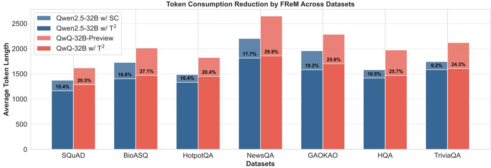

Figure 6: Token consumption reduction by $\mathrm { T ^ { 2 } }$ across different datasets. The percentage values indicate the relative reduction compared to the baseline models (Qwen2.5-32B w/ SC and QwQ-32B-Preview).
<table><tr><td rowspan="2">Model</td><td colspan="2">SQuAD</td><td colspan="2">BioASQ</td><td colspan="2">HotpotQA</td><td colspan="2">NewsQA</td></tr><tr><td>Token</td><td>ROUGE-L</td><td>Token</td><td>ROUGE-L</td><td>Token</td><td>ROUGE-L</td><td>Token</td><td>ROUGE-L</td></tr><tr><td>Qwen2.5-32B w/ SC</td><td>1372.18</td><td>75.31</td><td>1726.32</td><td>57.57</td><td>1485.87</td><td>56.76</td><td>2201.65</td><td>52.27</td></tr><tr><td>Qwen2.5-32B  $\mathrm { w / T ^ { 2 } }$ </td><td>1161.42</td><td>81.86</td><td>1401.52</td><td>65.02</td><td>1330.71</td><td>67.11</td><td>1812.28</td><td>61.27</td></tr><tr><td>QwQ-32B-Preview</td><td>1617.42</td><td>86.87</td><td>2012.33</td><td>69.02</td><td>1823.49</td><td>71.86</td><td>2648.12</td><td>63.92</td></tr><tr><td>QwQ-32B w/ T²</td><td>1285.36</td><td>92.12</td><td>1467.85</td><td>75.21</td><td>1450.75</td><td>77.61</td><td>1855.89</td><td>68.61</td></tr><tr><td rowspan="2">Model</td><td colspan="2">GAOKAO</td><td colspan="2">HQA</td><td colspan="2">TriviaQA</td><td colspan="2">Average</td></tr><tr><td>Token</td><td>ROUGE-L</td><td>Token</td><td>ROUGE-L</td><td>Token</td><td>ROUGE-L</td><td>Token</td><td>ROUGE-L</td></tr><tr><td>Qwen2.5-32B w/ SC</td><td>1957.93</td><td>30.57</td><td>1580.43</td><td>37.12</td><td>1742.41</td><td>41.92</td><td>1723.83</td><td>50.07</td></tr><tr><td>Qwen2.5-32B  $\mathrm { w / T ^ { 2 } }$ </td><td>1581.14</td><td>34.06</td><td>1415.18</td><td>40.31</td><td>1582.42</td><td>43.92</td><td>1469.24</td><td>56.22</td></tr><tr><td>QwQ-32B-Preview</td><td>2284.80</td><td>43.23</td><td>1972.37</td><td>49.62</td><td>2119.88</td><td>59.16</td><td>2068.34</td><td>63.38</td></tr><tr><td> $\mathrm { Q w Q { - } } 3 2 \mathrm { B } \ \mathrm { w } / \mathrm { T } ^ { 2 }$ </td><td>1699.45</td><td>47.42</td><td>1465.68</td><td>54.71</td><td>1605.56</td><td>64.22</td><td>1547.22</td><td>68.56</td></tr></table>

Table 19: Detailed comparison of token consumption and performance (ROUGE-L) across all datasets. Lower token count with higher ROUGE-L indicates better efficiency-performance trade-off.  
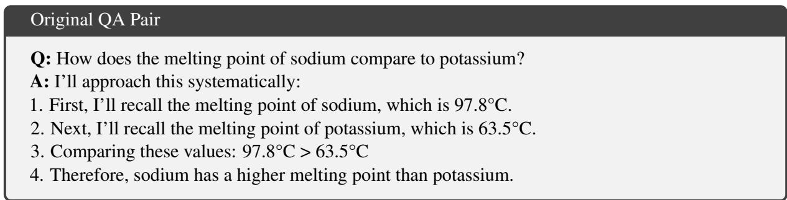  
Figure 7: Our original generated similar example.

<table><tr><td>Question Complexity</td><td> $\mathbf { Q } \mathbf { w e n } 2 . 5 + \mathbf { S } \mathbf { C }$ </td><td> $\mathbf { Q } \mathbf { w e n } 2 . 5 + \mathbf { T } ^ { 2 }$ </td><td>Token Reduction</td></tr><tr><td>Simple (1-step)</td><td>1283.45</td><td>1157.82</td><td>-9.8%</td></tr><tr><td>Moderate (2-3 steps)</td><td>1687.31</td><td>1391.65</td><td>-17.5%</td></tr><tr><td>Complex (4+ steps)</td><td>2201.73</td><td>1758.24</td><td>-20.1%</td></tr><tr><td>Question Complexity</td><td>QwQ-32B</td><td> $\mathbf { Q _ { w } Q { - } } 3 2 \mathbf { B } + \mathbf { T } ^ { 2 }$ </td><td>Token Reduction</td></tr><tr><td>Simple (1-step)</td><td>1584.21</td><td>1262.35</td><td>-20.3%</td></tr><tr><td>Moderate (2-3 steps)</td><td>2041.57</td><td>1492.18</td><td>-26.9%</td></tr><tr><td>Complex (4+ steps)</td><td>2579.24</td><td>1887.14</td><td>-26.8%</td></tr></table>

Table 20: Token consumption analysis by question complexity. $\mathrm { T ^ { 2 } }$ achieves greater efficiency gains for more complex questions.
<table><tr><td>Model</td><td>Avg. Inference Time (s)</td><td>Time Reduction</td></tr><tr><td>Qwen2.5-32B w/ SC</td><td>65.31</td><td></td></tr><tr><td> $\mathrm { Q w e n 2 . 5 - 3 2 B \ w / T ^ { 2 } }$ </td><td>34.52</td><td>-47.1%</td></tr><tr><td> $\mathrm { \bar { Q } w \bar { Q } ^ { - 3 \bar { 2 } B - P r e v i e w } }$ </td><td>76.74</td><td></td></tr><tr><td> $\mathrm { Q w Q { - } } 3 2 \mathrm { B } \ \mathrm { w } / \mathrm { T } ^ { 2 }$ </td><td>45.03</td><td>-41.3%</td></tr></table>

Table 21: Average inference time per question across datasets. $\mathrm { T ^ { 2 } }$ reduces computational time while maintaining high performance.
<table><tr><td rowspan="2">Group</td><td colspan="3">SQuAD</td><td colspan="3">HQA</td></tr><tr><td>Few-shots</td><td>Self-Cconsistency</td><td> $\mathrm { T ^ { 2 } }$ </td><td>Few-shots</td><td>Self-Cconsistency</td><td> $\mathrm { T ^ { 2 } }$ </td></tr><tr><td>Low</td><td>78.5</td><td>79.1</td><td>80.2</td><td>42.7</td><td>43.3</td><td>44.6</td></tr><tr><td>Medium</td><td>76.4</td><td>78.2</td><td>79.5</td><td>41.5</td><td>43.0</td><td>45.1</td></tr><tr><td>High</td><td>75.9</td><td>78.7</td><td>80.1</td><td>40.2</td><td>42.9</td><td>46.2</td></tr></table>

Table 22: ROUGE-L by question complexity. We compare quick-thinking (Few-shots) and slow-thinking (Self-Consistency), and our $\dot { \mathrm { T } } ^ { 2 }$

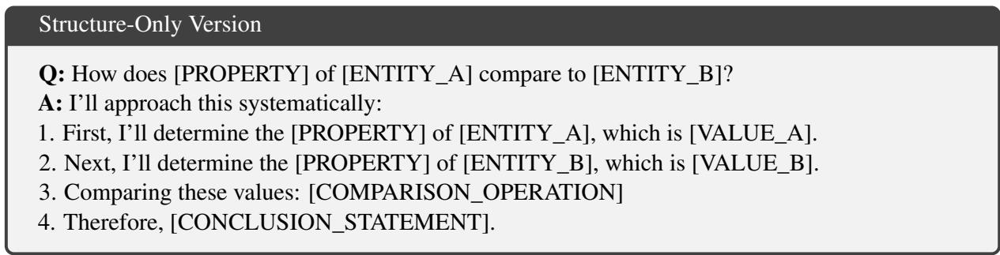  
Figure 8: Structure-only version of our generated similar example.

## J.3 Impacts of Similar Example Numbers

We vary the size $M = | \Gamma |$ . Figure 9 illustrates the performance on HotpotQA (left) and NewsQA (right) as M increases. We observe an initial boost in ROUGE-L scores before $M = 2 0 .$ , but performance plateaus or slightly decreases beyond a certain point. After increasing examples to $M = 8 0$ the performance rapidly decreases. We conclude that too many examples can introduce irrelevant or redundant paths, making selection harder. In practice, we find that generating a moderate pool is enough to cover essential patterns, especially if the examples are diverse and accurate.

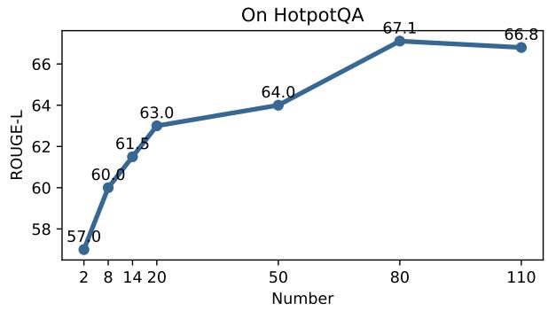

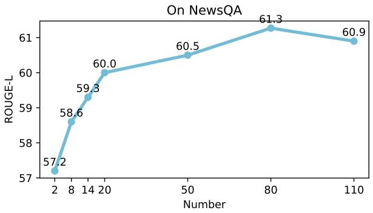  
Figure 9: Impact of the number of similar examples on ROUGE-L scores for HotpotQA (left) and NewsQA (right).

<table><tr><td>Method</td><td>ROUGE-L</td><td>Variation</td><td>Noise</td></tr><tr><td>Qwen2.5 w/ ours</td><td></td><td></td><td></td></tr><tr><td>Random Fill</td><td>49.8</td><td>High</td><td>Medium</td></tr><tr><td>Guided Fill</td><td>52.6</td><td>Low</td><td>Low</td></tr><tr><td>Template Variation</td><td>61.3</td><td>High</td><td>Low</td></tr></table>

Table 23: Comparing different example construction methods on NewsQA.

## J.4 Impacts of Example Generation Methods

Then, we consider how we synthesize reference examples. We experiment with different approaches for filling the placeholders on HotpotQA with qwen2.5-32B:

• Random Fill: Pick random words or entities of the same type (e.g., any person) from a large corpus.

• Guided Fill: Use an LLM or curated list to pick semantically relevant or thematically consistent entities for each placeholder.

• Template Variation: Generate minor paraphrases or new question stems while retaining the same skill sequence.

Table 23 shows that template variation produces more coherent examples, with 2–4% gains over purely random fill. This highlights the importance of a well-structured synthetic process: random replacements might yield too many off-topic or contradictory examples, while guided replacements and paraphrasing keep the examples relevant, improving the final answer selection.

<table><tr><td>Model</td><td>HotpotQA</td><td>HQA</td></tr><tr><td>Qwen2.5+SC</td><td>56.76</td><td>37.12</td></tr><tr><td>Qwen2.5+T²</td><td>67.11</td><td>40.31</td></tr><tr><td>Qwen2.5+mis domain</td><td>65.96</td><td>39.85</td></tr><tr><td>Qwen2.5+structure only</td><td>63.96</td><td>38.85</td></tr><tr><td>QwQ</td><td>71.86</td><td>49.62</td></tr><tr><td> $\scriptstyle { \bar { \mathrm { Q w Q } } } + { \mathrm { T } } ^ { 2 }$ </td><td>77.61</td><td>54.71</td></tr><tr><td>QwQ+mis domain</td><td>77.03</td><td>54.26</td></tr><tr><td>QwQ+structure only</td><td>74.03</td><td>53.66</td></tr></table>

Table 24: Performance on mis-domain and structureonly models. ROUGE-L is the reported performance metric.

## J.5 Impacts of Example Generation Threshold

We analyze the impact of varying the threshold δ on the synthesis quality of the generated questions. The threshold δ controls how similar the synthesized questions $Q _ { \mathrm { s y n } } ^ { i }$ are to the original question Q, by using a helper language model to assess their alignment (in Sec.3.3). Figure 10 shows finding a trade-off between question similarity and generalization is much more important. As δ increases, the similarity to the original question improves but at the cost of generalization. Conversely, when δ is lowered, the model generalizes better but the quality of the synthesized questions decreases.

## J.6 Impacts of Examples Domain Bias and Structural Bias

In addition, we investigate the effects of domain and structural biases in similar examples. Specifically, we assess how varying the domain of the similar examples influences model performance. As shown in the Table 24 (“+mis domain”), transitioning from a general domain to a historical one results in improved performance compared to using self-consistency alone. Furthermore, we evaluate the impact of removing key information from the similar examples, leaving only the reasoning structure. Table 24 (“+structure only”) demonstrates that even when only the examples’ structure4 is provided, the model can still generate appropriate responses, highlighting the effectiveness of structural guidance.

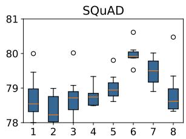

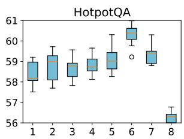

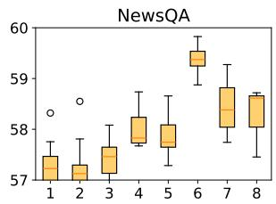

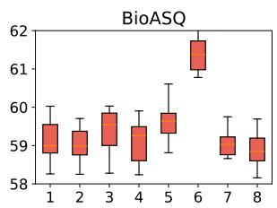  
Figure 10: Impact of the question synthesis scope.

## J.7 Impacts of Similar Examples Quality

To evaluate the quality of similar examples generated by our framework, we conducted a comprehensive human evaluation study. We randomly selected 1000 query-reference pairs from the HotpotQA dataset and recruited three Ph.D. students specializing in NLP to assess the quality of synthetic references. The evaluation was conducted blind, with evaluators unaware of which model generated each reference.

Evaluation Dimensions. References were rated on a scale of 1-10 across four key dimensions:

• Accuracy: Factual correctness and absence of hallucinations or contradictions

• Relevance: Degree to which the reference addresses the specific query requirements

• Completeness: Thoroughness in covering all necessary information and reasoning steps

• Coherence: Logical structure, clarity of expression, and overall readability

Model Comparison. We evaluated synthetic references generated by two foundation models: Qwen2.5-32B-Instrucut and QwQ-32B-Preview, both with our framework. Table 25 presents the average scores across all evaluators and samples.

Results show both models produced high-quality references. The highest scores were observed in the Relevance category, indicating that references effectively addressed the specific queries. The evaluation exhibited strong inter-annotator agreement with a Fleiss’ kappa coefficient of 0.79, indicating substantial agreement among the three evaluators.

This suggests the evaluation results are reliable and consistent across different human judges.

## K Detailed Case Studies

Figure 11 and 12 show the two different cases from HotPotQA and SQuAD. The two case studies illustrate distinct reasoning strategies for question answering. In the HotpotQA case, the task requires multi-step reasoning by integrating evidence from multiple documents. A response based solely on pattern matching might output wrong “London” and an overthinking answer may include unnecessary details before arriving at the correct conclusion, the best approach is a concise, step-by-step explanation that clearly connects the film to John Lennon and his documented birthplace.

In contrast, the SQuAD case involves single-step reasoning where the answer is directly available from the text. The document states that the Eiffel Tower was constructed in 1889, so the correct answer is deduced by simply extracting this fact. Although a pattern matching response may correctly state “1889” and an overcomplicated explanation might unnecessarily discuss other numerical details, the ideal answer succinctly identifies the key fact and deduces that the construction year is 1889 using clear, deductive reasoning.

<table><tr><td>Models w/  $\mathbf { T } ^ { 2 }$ </td><td>Accuracy</td><td>Relevance</td><td>Completeness</td><td>Coherence</td><td>Overall</td></tr><tr><td>Qwen2.5-32B-Instrucut</td><td>8.8</td><td>8.6</td><td>8.1</td><td>8.1</td><td>8.4</td></tr><tr><td>QwQ-32B-Preview</td><td>8.4</td><td>8.3</td><td>7.9</td><td>8.2</td><td>8.4</td></tr></table>

Table 25: Human evaluation scores for synthetic references generated by different models (scale: 1-10).

# HotpotQA Case Example with Multihop Thinking   
Document 1:   
John Lennon, the iconic musician and member of The Beatles, was born in Liverpool, England.   
Document 2:   
Nowhere Boy is a film that explores the early life of John Lennon, highlighting his formative years and influences.   
Question:   
In what city was the subject of the film Nowhere Boy born?   
Proper Reasoning Chain:   
1. Identify the Subject: Recognize that Nowhere Boy is about John Lennon. (Deductive)   
2. Extract Key Fact: From Document 1, note that John Lennon was born in Liverpool, England. (Deductive)   
3. Conclude: Therefore, the subject of the film was born in Liverpool. (Decompositional)   
1) Quick Thinking Model’s Wrong Answer:   
Answer: The subject of Nowhere Boy was born in London.   
2) Slow Thinking Model’s Overthinking Answer:   
Answer: After a lengthy analysis of various biographical details concerning John Lennon, including his early childhood,   
multiple hints in his music and interviews, and a discussion of several English cities mentioned in relation to his life,   
one might eventually conclude that the subject of Nowhere Boy was born in Liverpool.   
3) Model with Our $\mathbf { T } ^ { 2 , } \mathbf { s }$ Correct Answer:   
Answer: Since Nowhere Boy is a film about John Lennon (Document 2) and Document 1 confirms that John Lennon   
was born in Liverpool, we deduce that the subject of the film was born in Liverpool.

Figure 11: HotpotQA Case Example with Multiple Answer Versions and Explicit Reasoning Chain.  
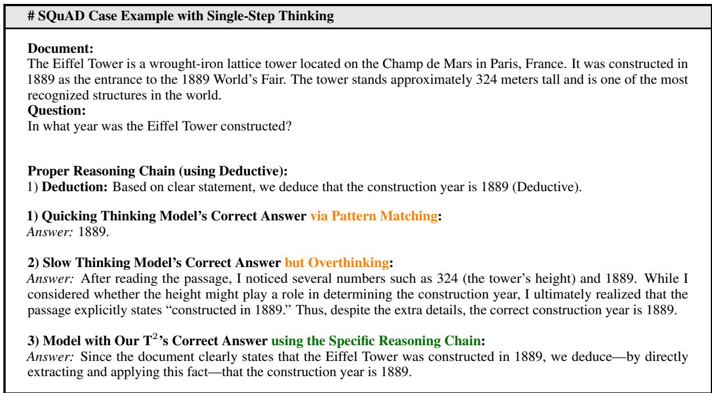  
Figure 12: SQuAD Case Example with Single-Step Thinking and Multiple Answer Versions.